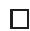
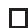
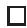
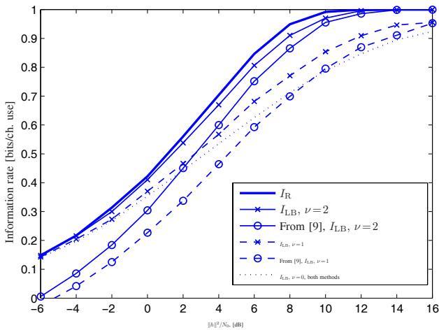
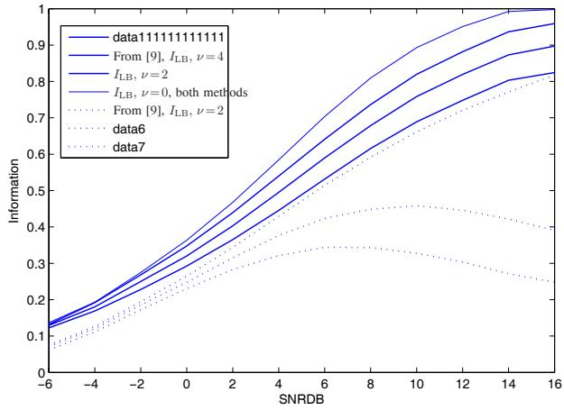
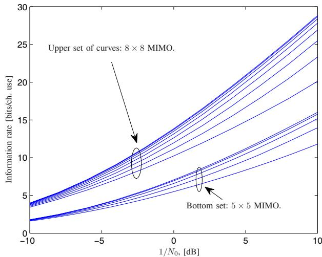
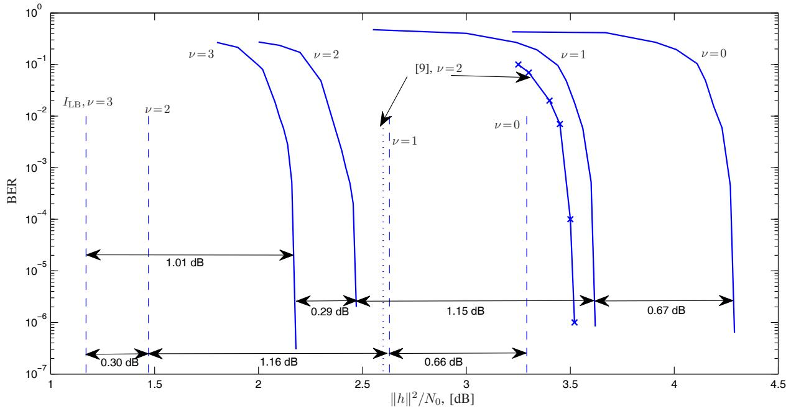
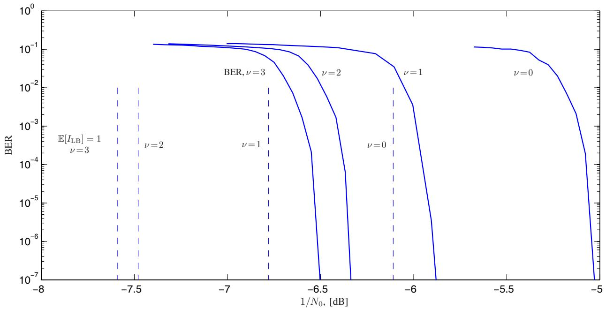

# Optimal Channel Shortening for MIMO and ISI Channels

Fredrik Rusek and Adnan Prlja

Abstract—We deal with the construction of optimal channel shortening, also known as combined linear Viterbi detection, algorithms for ISI and MIMO channels. In the case of MIMO channel shortening, the tree structure to represent MIMO signals is replaced by a trellis. The optimization is performed from an information theoretical perspective and the achievable information rates of the shortened models are derived and optimized. Closed form expressions for all components of the optimal detector of the class are derived. Furthermore, we show that previously published channel shortening algorithms can be seen as special cases of the derived model.

Index Terms—Equalization, reduced complexity detection, BCJR Algorithm, information rate computation, MIMO, intersymbol interference, receiver optimization, trellis detection, trellis optimization, applied Shannon theory, combined linear Viterbi detection.

# I. INTRODUCTION

HIS paper considers the construction and optimization T of reduced complexity trellis detection methods for intersymbol-interference (ISI) and multiple-input multipleoutput (MIMO) channels. Within trellis detection, there are two main directions: (1) To process the original trellis, but with reduced complexity so that only a fraction of the trellis is explored, and (2) To construct a reduced trellis which is then processed with full complexity. Examples from the first class include the sphere detector1 [1], the fixed-complexity sphere detector [3], the $M$ -algorithm [4], the soft-output $M$ - algorithm [5], and soft-output sequential detection [6]. In this paper we optimize a general framework, first proposed in [8], for detectors from the second class. We investigate detectors that filter the received signal with a channel shortening filter, and then apply trellis processing on the shortened model. In the case of MIMO transmission, the filter is replaced with a matrix multiplication that aims at converting the MIMO tree structure into a much smaller trellis.

The history of channel shortening traces back to the early 70s, sometimes under the name combined linear Viterbi

Manuscript received May 2, 2011; revised September 19, 2011 and November 29, 2011; accepted December 2, 2011. The associate editor coordinating the review of this paper and approving it for publication was W. Zhang.

The authors are with the Dept. of Electrical and Information Technology, Lund University, Lund, Sweden (e-mail: {fredrik.rusek, adnan.prlja}@eit.lth.se).

The work of F. Rusek was supported by the Swedish Foundation for Strategic Research (SSF) through the distributed antenna project Lund University. The work of A. Prlja was supported by the Swedish Research Council (VR) through Grant 621-2003-3210.

Digital Object Identifier 10.1109/TWC.2011.121911.110809

1The sphere detector is optimal in the case of hard output detection, but not when used for soft output detection [2]

equalization. Forney showed in 1972 that the Viterbi algorithm implements maximum-likelihood (ML) detection of ISIchannels [7]. Shortly after Forney’s discovery, researchers realized that in many practical scenarios, the duration of the channel response is far too long for practical implementation of the Viterbi algorithm. This generated massive research efforts in order to reduce the computational complexity of the Viterbi algorithm. One approach that appeared promising was channel shortening. Falconer and Magee in 1973 conducted the first investigation of channel shortening [9]. Since Falconer and Magee’s work, research on channel shortening has been continuously published [10]–[18]. So far, all channel shortening detectors have been optimized from a minimum mean-square-error (MMSE) perspective. However, MSE is a secondary metric since it does not directly correspond to the highest transmission rate (in the Shannon sense) that can be supported by a shortening detector. Later, the Shannon limits of mismatched detectors were derived in [19], [20], named generalized mutual information. Since a channel shortening detector approximates the true channel with a shorter channel it falls under the framework of mismatched detection. Thus, in the early days of channel shortening, the tools in [19], [20] for optimizing the shortening detector were not available. Furthermore, another difference between this paper and [9]– [18] is that this paper uses a more general framework for channel shortening. Hence, the detectors derived in this paper are out of reach in [9]–[18].

The framework in this paper builds upon [8], but is extended in several important directions:

∙ This paper considers general linear channels, while [8] only treated ISI channels.   
∙ The framework from [8] is in this paper optimized for Gaussian inputs and closed form expressions for the filters and the resulting generalized mutual informations are obtained.   
∙ We discover that the optimal channel shortening filter is intimately connected to the conventional MMSE filter. The difference is that the optimal channel shortening filter is modified to incorporate the trellis processing. The derived filter differs from the filters used in [9]–[18].   
∙ We provide the optimal branch labels of the reduced trellis in closed form.

# A. System Model

We consider linearly-modulated transmissions over linear vector-channels affected by additive white Gaussian noise (AWGN). Under the assumption of ideal synchronization, the received signal can be described by the following

discrete-time model

$$
\boldsymbol {y} = \boldsymbol {H} \boldsymbol {x} + \boldsymbol {w} \tag {1}
$$

where $\begin{array} { c c l } { \pmb { y } } & { = } & { \left[ y _ { 1 } , \ldots , y _ { M } \right] ^ { \mathrm { T } } } \end{array}$ denotes the output symbols, $\mathbf {  { x } } = ~ [ x _ { 1 } , \dots , x _ { N } ] ^ { \mathrm { T } }$ denotes the input symbols, and $\begin{array} { r l } { w } & { { } = } \end{array}$ $[ w _ { 1 } , \ldots , w _ { M } ] ^ { \mathrm { T } }$ are independent and identically distributed zero mean circulary symmetric complex Gaussian random variables with variance $N _ { 0 }$ . The superscript “T” denotes the transpose operator. The $M \times N$ complex-valued matrix $_ { H }$ describes the linear channel which is assumed to be perfectly known at the receiver. The input symbols $\{ x _ { k } \}$ belong to a constellation $\mathcal { X }$ .

In the case of $M \ne N$ it is possible to convert the channel into an $N \times N$ channel as follows. If $M > N$ , the channel model can be QR-decomposed into ${ \pmb y } = Q R { \pmb x } + { \pmb w }$ . The matrix $\pmb { R }$ can be written as

$$
\boldsymbol {R} = \left[ \begin{array}{c} \tilde {\boldsymbol {R}} \\ \mathbf {0} _ {M - N, N} \end{array} \right],
$$

where $\mathbf { 0 } _ { M - N , N }$ is the all zero matrix of size $( M - N ) \times N$ and $\tilde { \boldsymbol { R } }$ is an $N \times N$ upper triangular matrix. This implies that optimal detection of $_ { x }$ can be made by only considering the first $N$ components of $\textbf {  { y } }$ , denote these by $\tilde { y }$ , so that we can work with

$$
\tilde {\boldsymbol {y}} = \tilde {\boldsymbol {R}} \boldsymbol {x} + \tilde {\boldsymbol {w}}.
$$

In the case $M < N$ , we append zeros to the channel matrix. Hence we consider the channel model

$$
\bar {\boldsymbol {y}} = \left[ \begin{array}{c} \boldsymbol {H} \\ \mathbf {0} _ {N - M, N} \end{array} \right] \boldsymbol {x} + \bar {\boldsymbol {n}},
$$

where $\bar { \bf y }$ is an $N \times 1$ column vector of received symbols, and $\bar { \mathbf { n } }$ is an $N \times 1$ noise vector. Later in the paper, we shall make no restrictions on the structure of the channel matrix, so that appending zeros is “allowed”. In this way, we can safely assume that $M = N$ in the reminder of the paper.

The highest rate $I _ { \mathrm { R } }$ that can be transmitted over the channel (1), subject to the fixed constellation $\mathcal { X }$ and a certain input symbol distribution, is referred to as the information rate of the system (capacity requires an optimization over the input distribution and constellation). The information rate equals

$$
\begin{array}{l} I _ {\mathrm {R}} = I (\mathbf {Y}; \mathbf {X}) \\ = \mathfrak {h} (\boldsymbol {Y}) - \mathfrak {h} (\boldsymbol {Y} | \boldsymbol {X}), \tag {2} \\ \end{array}
$$

where $I ( Y ; X )$ is the mutual information operator, and $\mathfrak { h } ( \cdot )$ is the $N$ -dimensional differential entropy operator. Note that a bold capital letter denotes a random vector while a bold lower case letter denotes its realization; deterministic matrices are also written with bold capital letters. Unless stated otherwise, the natural logarithm is used which means that mutual informations are expressed in nats per channel use.

In order to reach the ultimate limit $I _ { \mathrm { R } }$ , a maximum-aposteriori (MAP) detector must be adopted in order to evaluate the posterior probabilities

$$
\mathrm {p} _ {\boldsymbol {X} \mid \boldsymbol {Y}} (\boldsymbol {X} = \boldsymbol {x} \mid \boldsymbol {Y} = \boldsymbol {y}), \quad \forall \boldsymbol {x} \in \mathcal {X} ^ {N}.
$$

As an alternative, the ML rule can be used. The symbolwise MAP detector is implemented by first performing a QR-decomposition of the channel matrix, and then running

the BCJR algorithm on the remaining tree-structure. Unless the channel matrix $\pmb { H }$ possesses some special structure, the complexity of the BCJR grows as $| \mathcal { X } | ^ { N }$ , which quickly gets prohibitive as $N$ and/or $| \mathcal { X } |$ grows. In next section we address the problem of optimally “shortening” the memory of the channel for signals described by (1). The efficiency of the “shortening”-detector is measured by the highest communication rate that can be supported when the detector is used. Since the shortening detector is of reduced complexity, this rate must be strictly less than $I _ { \mathrm { R } }$ . The advantage of this approach with respect to more common approaches, such as measuring the error rate performance of a coded system, is that it gives the ultimate performance limit characterizing the detector, and does not depend on the specific outer code adopted.

# B. Reduced Complexity Trellis Based Detectors

The input-output relation of the channel is completely described through

$$
\begin{array}{l} p _ {\boldsymbol {Y} \mid \boldsymbol {X}} (\boldsymbol {y} \mid \boldsymbol {x}) = \frac {1}{(\pi N _ {0}) ^ {N}} \exp \left(- \frac {\| \boldsymbol {y} - \boldsymbol {H} \boldsymbol {x} \| ^ {2}}{N _ {0}}\right) \\ = \frac {1}{\left(\pi N _ {0}\right) ^ {N}} \exp \left(- \frac {\boldsymbol {y} ^ {\dagger} \boldsymbol {y} - 2 \mathcal {R} \{\boldsymbol {y} ^ {\dagger} \boldsymbol {H} \boldsymbol {x} \} + \boldsymbol {x} ^ {\dagger} \boldsymbol {G} \boldsymbol {x}}{N _ {0}}\right) \tag {3} \\ \end{array}
$$

where we defined $G \triangleq H ^ { \dagger } H$ , $\mathcal { R } \{ x \}$ denotes the real part of $x$ , and “†” denotes Hermitian transpose. The factorization (3) was first exploited for ML detection by Ungerboeck in [21], while a symbolwise MAP detector based on (3) was first derived by Colavolpe and Barbieri in [22].

In [8] a low-complexity detector based on (3) is introduced, (3) is replaced with

$$
\tilde {p} (\boldsymbol {y} \mid \boldsymbol {x}) = \frac {1}{(\pi N _ {\mathrm {r}}) ^ {N}} \exp \left(- \frac {\boldsymbol {y} ^ {\dagger} \boldsymbol {y} - 2 \mathcal {R} \{\boldsymbol {y} ^ {\dagger} \boldsymbol {H} ^ {\mathrm {r}} \boldsymbol {x} \} + \boldsymbol {x} ^ {\dagger} \boldsymbol {G} ^ {\mathrm {r}} \boldsymbol {x}}{N _ {\mathrm {r}}}\right), \tag {4}
$$

where the mismatched noise density $N _ { \mathrm { r } }$ and the matrices $H ^ { \mathrm { r } }$ and $G ^ { \mathrm { r } }$ are subject to optimization. Note that $\tilde { p } ( \boldsymbol { y } | \boldsymbol { x } )$ may not be a valid conditional probability density function, but that will be unimportant later.

Since the term $\exp ( - \| \pmb { y } \| ^ { 2 } / N _ { \mathrm { r } } )$ is irrelevant for the detection process (it is constant with respect to $_ { \pmb { x } }$ ), it can be removed and it follows that we can without loss of generality absorb $N _ { \mathrm { r } }$ into $H ^ { \mathrm { r } }$ and $G ^ { \mathrm { r } }$ so that we can set $N _ { \mathrm { r } } = 1$ . Furthermore, the constant $\pi ^ { - N }$ is irrelevant for detection purposes and can be removed. Consequently, instead of working with (4), we redefine $\tilde { p } ( \boldsymbol { y } | \boldsymbol { x } )$ as

$$
\tilde {p} (\boldsymbol {y} | \boldsymbol {x}) \triangleq \exp \left(2 \mathcal {R} \left\{\boldsymbol {x} ^ {\dagger} \left(\boldsymbol {H} ^ {\mathrm {r}}\right) ^ {\dagger} \boldsymbol {y} \right\} - \boldsymbol {x} ^ {\dagger} \boldsymbol {G} ^ {\mathrm {r}} \boldsymbol {x}\right). \tag {5}
$$

Observe that the need for trellis processing of (4) lies solely in the matrix $G ^ { \mathrm { r } }$ . In order to satisfy the reduced memory constraint, i.e., to “shorten the matrix”, we constrain ${ \cal G } ^ { \mathrm { r } }$ to satisfy the following property

$$
\left(\boldsymbol {G} ^ {\mathrm {r}}\right) _ {m n} = 0 \quad \text {i f} | m - n | > \nu , \tag {6}
$$

where $( G ^ { \mathrm { r } } ) _ { m n }$ denotes the element of the matrix $( G ^ { \mathrm { r } } )$ at row $m$ and column ??; ?? denotes memory of the reduced trellis. Hence, symbolwise MAP detection based on (5), as proposed in this paper, requires $| { \mathcal { X } } | ^ { \nu }$ states. The branch labels

of the trellis are uniquely given from the matrix ${ \cal G } ^ { \mathrm { r } }$ together with the constellation $\mathcal { X }$ . In the case of MIMO transmission, a complexity reduction by a factor $| \mathcal { X } | ^ { N - \nu }$ is achieved in general.

Conventional channel shortening, [9]–[17], can be seen as the special case of (4) when the matrix $H ^ { \mathrm { r } }$ factorizes as $\pmb { H } ^ { \mathrm { r } } =$ $W F$ and $G ^ { \mathrm { r } } = F ^ { \dagger } F$ . Implicit in such factorization is that $\pmb { F }$ is regarded as the shortened channel, while ?? is the “channel shortener”, i.e., the task of $W$ is to force $W ^ { \dagger } { \pmb { H } }$ close to $\pmb { F }$ . Since the term $y ^ { \dag } y$ is irrelevant for the detection process, the conventional channel shortening method implies that (3) is replaced by

$$
\frac {1}{(\pi N _ {0}) ^ {N}} \exp \left(- \frac {\| \boldsymbol {W} \boldsymbol {y} - \boldsymbol {F} \boldsymbol {x} \| ^ {2}}{N _ {0}}\right). \tag {7}
$$

In this paper we show that detectors limited to the form (7) are not optimal from a mutual information perspective. The reason is that the optimal matrix $G ^ { \mathrm { r } }$ to use in (5) may not be positive semi-definite, so that no factorization $G ^ { \mathrm { r } } = F ^ { \dagger } \bar { F }$ exist. Consequently, conventional channel shortening algorithms are not optimal since they are restricted to input-output relations of the form (7). Finally, we mention that the form (7) is not bounded away from the performance of (5) in the case of equal power input symbols, i.e.,

$$
\left| x _ {k} \right| ^ {2} = P, \quad \forall x _ {k} \in \mathcal {X},
$$

for some constant $P$ . See [8] for the proof.

# C. Achievable Information Rates of the Reduced Complexity Detector

A detector that operates on the basis of $\tilde { p } ( \boldsymbol { y } | \boldsymbol { x } )$ given in (4), instead of the true conditional density $\operatorname { p } _ { Y \mid X } ( \pmb { y } | \pmb { x } )$ , can support an arbitrarily small error probability if the communication rate is smaller than $I _ { \mathrm { A I R } }$ , where $I _ { \mathrm { A I R } }$ is referred to as the achievable information rate. 2 Further, it is known that for any strictly positive $\tilde { p } ( \boldsymbol { y } | \boldsymbol { x } )$ [23]

$$
\begin{array}{l} I _ {\mathrm {A I R}} \geq I _ {\mathrm {L B}} \\ \triangleq - \mathbb {E} _ {\boldsymbol {Y}} \left[ \log_ {2} (\tilde {p} (\boldsymbol {y})) \right] + \mathbb {E} _ {\boldsymbol {Y}, \boldsymbol {X}} \left[ \log_ {2} (\tilde {p} (\boldsymbol {y} | \boldsymbol {x})) \right], (8) \\ \end{array}
$$

where $\mathbb { E } _ { Y }$ denotes the expectation operator with respect to the random variable $\mathbf { Y }$ and

$$
\tilde {p} (\boldsymbol {y}) \triangleq \sum_ {\boldsymbol {s} \in \mathcal {X} ^ {N}} \tilde {p} (\boldsymbol {y} | \boldsymbol {s}) p _ {\boldsymbol {X}} (\boldsymbol {s}). \tag {9}
$$

The lower bound $I _ { \mathrm { L B } }$ is directly impacted by the choices of $G ^ { \mathrm { r } }$ and $\pmb { H } ^ { \mathrm { r } }$ . The optimization

$$
\max  _ {\boldsymbol {G} ^ {\mathrm {r}}, \boldsymbol {H} ^ {\mathrm {r}}} I _ {\mathrm {L B}},
$$

is the primary goal of this paper and is treated in Section II.

2Observe that this is not the generalized mutual information, which requires an optimization over the input constellation and distribution. The achievable information rate corresponds to the generalized mutual information without this optimization.

D. An upper bound to the information rate computed with the proposed reduced complexity trellis detector

It is known from [8] that if $G ^ { \mathrm { r } } - ( H ^ { \mathrm { r } } ) ^ { \dagger } H ^ { \mathrm { r } }$ is a positive semidefinite matrix, an upper bound to the true information rate can be expressed as

$$
\begin{array}{l} I _ {\mathrm {R}} \leq I _ {\mathrm {U B}} \\ \triangleq - \mathbb {E} _ {\boldsymbol {Y}} \left[ \log_ {2} (\tilde {p} (\boldsymbol {y})) \right] - N \log_ {2} \left(\pi \exp (1) N _ {0}\right). \tag {10} \\ \end{array}
$$

The optimization

$$
\min_{\substack{\boldsymbol{G}^{\mathrm{r}},\boldsymbol{H}^{\mathrm{r}}}}I_{\mathrm{UB}},
$$

is briefly treated in Section III. Unlike the lower bound, the upper bound has no operational meaning. However, bounding the information rate of linear channels with discrete inputs is a well established problem within information theory. The bound (10) represents a novel upper bound which can be evaluated by low-complexity numerical methods.

# II. OPTIMIZATION OF $I _ { \mathrm { L B } }$ FOR GAUSSIAN INPUTS

The goal of this section is to maximize $I _ { \mathrm { L B } }$ . For a discrete alphabet $\mathcal { X }$ this is a complicated task. However, for Gaussian inputs, a closed form expression can be obtained. One may ask what the value of an optimized detector for Gaussian inputs when used for, say, BPSK inputs really is? But when the optimized detectors for Gaussian inputs are used for discrete alphabets, simulations will verify that the ensuing $I _ { \mathrm { L B } }$ is excellent.

Under the assumption of Gaussian inputs, we can prove

Proposition 1: With zero-mean, unit-variance, circulary symmetric complex Gaussian inputs, and a given Hermitian matrix $G ^ { \mathrm { r } }$ with smallest eigenvalue larger than $- 1$ , the optimal receiver filter is

$$
\boldsymbol {H} ^ {\mathrm {r}} = \left[ \boldsymbol {H} \boldsymbol {H} ^ {\dagger} + N _ {0} \boldsymbol {I} \right] ^ {- 1} \boldsymbol {H} \left[ \boldsymbol {G} ^ {\mathrm {r}} + \boldsymbol {I} \right].
$$

For this $H ^ { \mathrm { r } }$ , $I _ { \mathrm { L B } }$ equals,

$$
\begin{array}{l} I _ {\mathrm {L B}} = \log (\det  (\boldsymbol {I} + \boldsymbol {G} ^ {\mathrm {r}})) \\ + \operatorname {T r} \left(\left[ G ^ {\mathrm {r}} + I \right] H ^ {\dagger} \left[ H H ^ {\dagger} + N _ {0} I \right] ^ {- 1} H\right) \\ - \operatorname {T r} \left(\boldsymbol {G} ^ {\mathrm {r}}\right). \\ \end{array}
$$

The proof is given in Appendix 1.

Intrestingly, the optimal front-end-filter $\pmb { H } ^ { \mathrm { r } }$ equals the standard MMSE/Wiener filter, compensated by the receiver trellis processing. The trellis processing is represented through $G ^ { \mathrm { r } } + I$ rather than only $G ^ { \mathrm { r } }$ - a somewhat surprising fact.

It is interesting to observe that the first term of the achievable rate equals the conventional mutual information for a vector channel with associated Gram matrix ${ \cal G } ^ { \mathrm { r } }$ . The penalty terms for having a mismatched channel model are linear in $G ^ { \mathrm { r } }$ . It remains to optimize $I _ { \mathrm { L B } }$ in Proposition 1.

Next we turn our attention towards such optimization. By the eigenvalue assumption in Proposition 1, it follows that $^ { I + }$ $G ^ { \mathrm { r } }$ is positive definite, hence it has a Cholesky Factorization $\pmb { I } + \pmb { G } ^ { \mathrm { \bar { r } } } = \pmb { U } ^ { \dagger } \pmb { U }$ . Due to the memory constraint (6), it follows that the upper triangular matrix $U$ only contains $\nu + 1$ nonzero

diagonals. We summarize our findings on the optimal ${ \cal G } ^ { \mathrm { r } }$ and the ensuing achievable information rate in

Proposition 2: Define

$$
\boldsymbol {B} \triangleq - \boldsymbol {H} ^ {\dagger} \left[ \boldsymbol {H} \boldsymbol {H} ^ {\dagger} + N _ {0} \boldsymbol {I} \right] ^ {- 1} \boldsymbol {H} + \boldsymbol {I}. \tag {11}
$$

Let $\tilde { B } _ { k } ^ { \nu }$ denote the submatrix

$$
\tilde {\boldsymbol {B}} _ {k} ^ {\nu} = \left[ \begin{array}{c c c} B _ {k + 1   k + 1} & \dots & B _ {k + 1   \min  (N, k + \nu)} \\ \vdots & \ddots & \vdots \\ B _ {\min  (N, k + \nu)   k + 1} & \dots & B _ {\min  (N, k + \nu)   \min  (N, k + \nu)} \end{array} \right],
$$

of $\textbf {  { B } }$ , and let $b _ { k } ^ { \nu }$ be the row vector $\begin{array} { r l } { b _ { k } ^ { \nu } } & { { } = } \end{array}$ $[ B _ { k k + 1 } , \dots B _ { N \operatorname* { m i n } ( M , k + \nu ) } ]$ . For $\begin{array} { r l r } { k } & { { } = } & { N } \end{array}$ , $\tilde { B } _ { k } ^ { ^ { \nu } } \quad = \quad 0$ and $\begin{array} { r l r l } {  { b _ { k } ^ { \nu } } } & { { } = } & { 0 } \end{array}$ . Let $\pmb { u } _ { k } ^ { \nu }$ denote the row vector $\begin{array} { r c l } { \pmb { u } _ { k } ^ { \nu } } & { = } & { \left[ u _ { k k + 1 } , \dots u _ { N \operatorname* { m i n } ( M , k + \nu ) } \right] } \end{array}$ , where $\{ u _ { m n } \}$ are the elements of $U$ . Then,

$$
\max  _ {\boldsymbol {G} ^ {\mathrm {r}}} I _ {\mathrm {L B}} = \sum_ {n = 1} ^ {N} \log \left(\frac {1}{c _ {n}}\right), \tag {12}
$$

where the constants $c _ { n }$ are given by

$$
c _ {n} = B _ {n n} - \pmb {b} _ {n} ^ {\nu} (\tilde {\pmb {B}} _ {n} ^ {\nu}) ^ {- 1} (\pmb {b} _ {n} ^ {\nu}) ^ {\dagger}.
$$

The optimal $\boldsymbol { G } ^ { \mathrm { r } } = \boldsymbol { U } \boldsymbol { U } ^ { \dagger } - \boldsymbol { I }$ is constructed from

$$
u _ {n n} = \frac {1}{\sqrt {c _ {n}}}
$$

and

$$
\boldsymbol {u} _ {n} ^ {\nu} = - u _ {n n} \boldsymbol {b} _ {n} ^ {\nu} (\tilde {\boldsymbol {B}} _ {n} ^ {\nu}) ^ {- 1}.
$$

The proof is given in Appendix 2.

By making use of the matrix inversion lemma, the optimal achievable rate can be expressed as

$$
\begin{array}{l} \max  _ {\boldsymbol {G} ^ {\mathrm {r}}} I _ {\mathrm {L B}} = \sum_ {n = 1} ^ {N} \log \left(\frac {1}{c _ {n}}\right) \\ = \sum_ {n = 1} ^ {N} \log \left(\left(\left(\tilde {\boldsymbol {B}} _ {n - 1} ^ {\nu + 1}\right) ^ {- 1}\right) _ {1 1},\right). \tag {13} \\ \end{array}
$$

However, we have not found any additional insight from this form.

As a final remark we mention that with $\nu = N - 1$ , i.e., a full complexity detector, we get that $I _ { \mathrm { L B } } = \log ( \operatorname* { d e t } ( I +$ $H H ^ { \dagger } / N _ { 0 } )$ ). With $\nu = 0$ , we obtain the performance of a MMSE detector. Hence, the proposed scheme trades detection complexity against achievable information rate, but is general enough to include optimal schemes at full and minimum complexity.

Next we treat the special case of ISI channels.

# A. ISI Receivers

The special case of ISI channels can also be casted on channel model (1). In this case, we let the channel matrix $\pmb { H }$ represent circular convolution with a $K$ -tap discrete-time response $^ h$ . As $N$ grows large, the circular convolution represents normal convolution to any given precision, see [24] for an extensive information theoretical treatment.

Propositions 1 and 2 can still be applied to derive the optimal detector, but since the block length $N$ is large for ISI channels, typically 1000 or more, simplifications are possible. The matrices $\pmb { H } ^ { \mathrm { r } }$ and $G ^ { \mathrm { r } }$ are uniquely characterized by the discrete sequences $\boldsymbol { h } ^ { \mathrm { r } }$ and $\boldsymbol { g } ^ { \mathrm { r } }$ . Let $H ^ { \mathrm { r } } ( \omega )$ and $G ^ { \mathrm { r } } ( \omega )$ denote the Fourier transforms of these respectively. For ISI channels, the quantity of interest is

$$
I _ {\mathrm {L B}} = \lim  _ {N \rightarrow \infty} \frac {1}{N} \left[ - \mathbb {E} _ {\boldsymbol {Y}} \left[ \log_ {2} (\tilde {p} (\boldsymbol {y})) \right] + \mathbb {E} _ {\boldsymbol {Y}, \boldsymbol {X}} \left[ \log_ {2} (\tilde {p} (\boldsymbol {y} | \boldsymbol {x})) \right]\right]. \tag {14}
$$

In order to get better understanding of $I _ { \mathrm { L B } }$ , we translate Proposition 1 into an ISI formulation,

Proposition 3: For ISI channels with transfer function $H ( \omega )$ and a particular receiver trellis represented through $G ^ { \mathrm { r } } ( \omega )$ , where $\mathrm { m i n } _ { \omega } G ^ { \mathrm { r } } ( \omega ) > - 1$ , the optimal receiver filter is given by

$$
H ^ {\mathrm {r}} (\omega) = \frac {H ^ {\dagger} (\omega)}{| H (\omega) | ^ {2} + N _ {0}} (G ^ {\mathrm {r}} (\omega) + 1).
$$

Furthermore, $I _ { \mathrm { L B } }$ becomes

$$
I _ {\mathrm {L B}} = \frac {1}{2 \pi} \int_ {- \pi} ^ {\pi} \log \left(G ^ {\mathrm {r}} (\omega) + 1\right) + \frac {\left| H (\omega) \right| ^ {2} - N _ {0} G ^ {\mathrm {r}} (\omega)}{\left| H (\omega) \right| ^ {2} + N _ {0}} \mathrm {d} \omega . \tag {15}
$$

The proof is deferred to Appendix 3.

In order to derive the optimal $G ^ { \mathrm { r } } ( \omega )$ we can make use of Proposition 2 directly. The matrix $_ B$ is a Toeplitz matrix that is characterized through the transform (easiest seen from the expression in Appendix 2)

$$
B (\omega) = \frac {N _ {0}}{| H (\omega) | ^ {2} + N _ {0}}.
$$

As $N  \infty$ , the matrix $\tilde { B } _ { n } ^ { \nu }$ ?? is the same for all $n$ and the dimension is always $\nu \times \nu$ . The vector $b _ { n } ^ { \nu }$ is always a $1 \times \nu$ vector and is the same for all $n$ . The elements of $\bar { \tilde { B } } ^ { \nu }$ and $\pmb { b } ^ { \nu }$ , where we left out the subindex $n$ since it is irrelevant for ISI channels, are formed from

$$
\int B (\omega) \exp (- i \omega k) \mathrm {d} \omega , | k | \leq \nu .
$$

The achievable information rate becomes

$$
I _ {\mathrm {L B}} = \log \left(\frac {1}{c}\right),
$$

where

$$
c = \int B (\omega) \mathrm {d} \omega - \boldsymbol {b} ^ {\nu} \left(\tilde {\boldsymbol {B}} ^ {\nu}\right) ^ {- 1} \left(\boldsymbol {b} ^ {\nu}\right) ^ {\dagger}.
$$

# III. OPTIMIZATION OF $I _ { \mathrm { U B } }$ FOR GAUSSIAN INPUTS

Only the first term of (10) needs to be evaluated. This is, however, already done in the proof of Proposition 1 and (23) gives the answer. After some standard manipulations, it follows that

$$
\begin{array}{l} I _ {\mathrm {U B}} = \log (\det  (G ^ {\mathrm {r}} + I)) \\ + \operatorname {T r} \left(\left[ \boldsymbol {H} \boldsymbol {H} ^ {\dagger} + N _ {0} \boldsymbol {I} \right] \left[ \boldsymbol {I} - \boldsymbol {H} ^ {\mathrm {r}} \left(\boldsymbol {G} ^ {\mathrm {r}} + \boldsymbol {I}\right) ^ {- 1} \left(\boldsymbol {H} ^ {\mathrm {r}}\right) ^ {\dagger} \right]\right) \\ - N \log (\pi \exp (1) N _ {0}). \tag {16} \\ \end{array}
$$

  
Fig. 1. Achievable rates of the EPR4 ISI channel with $\nu = 0 , \ldots , 3$ for the mutual information and the MMSE optimized detectors. The legend shows the curves from top to bottom at the right hand side of the figure.

For ISI channels, (16) simplifies into

$$
\begin{array}{l} I _ {\mathrm {U B}} = \frac {1}{2 \pi} \int_ {- \pi} ^ {\pi} \log (1 + G ^ {\mathrm {r}} (\omega)) + [ | H (\omega) | ^ {2} + N _ {0} ] \\ \left[ 1 - \frac {\left| H ^ {\mathrm {r}} (\omega) \right| ^ {2}}{G ^ {\mathrm {r}} (\omega) + 1} \right] \mathrm {d} \omega - \log \left(\pi \exp (1) N _ {0}\right). \tag {17} \\ \end{array}
$$

Minimizing (17) over $H ^ { \mathrm { r } } ( \omega )$ is equivalent of maximizing

$$
\frac {1}{2 \pi} \int_ {- \pi} ^ {\pi} [ | H (\omega) | ^ {2} + N _ {0} ] \frac {| H ^ {\mathrm {r}} (\omega) | ^ {2}}{G ^ {\mathrm {r}} (\omega) + 1} \mathrm {d} \omega . \tag {18}
$$

In order to satisfy the constraint that $G ^ { \mathrm { r } } - ( H ^ { \mathrm { r } } ) ^ { \dagger } H ^ { \mathrm { r } }$ is positive semi-definite, it must hold that

$$
\left| H ^ {\mathrm {r}} (\omega) \right| ^ {2} \leq G ^ {\mathrm {r}} (\omega). \tag {19}
$$

It is clear that there should be equality in (19) in order to maximize (18). We have therefore shown

Proposition 4: For ISI channels, the optimal receiver filter is

$$
H ^ {\mathrm {r}} (\omega) = \sqrt {G ^ {\mathrm {r}} (\omega)},
$$

which yields the upper bound

$$
\begin{array}{l} I _ {\mathrm {U B}} = \frac {1}{2 \pi} \int_ {- \pi} ^ {\pi} \log (1 + G ^ {\mathrm {r}} (\omega)) \\ + \frac {\left| H (\omega) \right| ^ {2} + N _ {0}}{G ^ {\mathrm {r}} (\omega) + 1} \mathrm {d} \omega - \log \left(\pi \exp (1) N _ {0}\right). \tag {20} \\ \end{array}
$$

□

This result is important since it reveals that choosing an ISI response $f$ that is “close” to $^ h$ and then using $f$ as it was exactly $^ { h }$ is the optimal strategy in terms of minimizing the upper bound. In terms of ?? from (7), this means that $W = I$ . Hence, there should be no “active channel shortening” at all.

# IV. NUMERICAL RESULTS ON ACHIEVABLE INFORMATION RATES

Next we turn our attention towards numerical results for the achievable rates of the reduced detector. We first consider the EPR4 channel,

$$
\boldsymbol {h} = \left[ \frac {1}{2}, \frac {1}{2}, - \frac {1}{2}, - \frac {1}{2} \right]
$$

  
Fig. 2. Achievable rates of the 5-tap uniform power ISI channel with $\nu = 0 , 2$ and 4 for the mutual information and the MMSE optimized detectors. The legend shows the curves from top to bottom at the right hand side of the figure.

with BPSK inputs in Figure 1. We plot the information rates $I _ { \mathrm { L B } }$ , in bits per channel use, for the mutual information optimized detector as well as the MMSE optimized detector from [9]. The legend shows the curves from top to bottom at the right hand side of the figure. The top heavy line shows the information rate corresponding to a full complexity detector, i.e., $\nu = 3$ . The two solid lines marked with x-es show $I _ { \mathrm { L B } }$ for the mutual information rate optimized detector with $\nu = 1$ and 2 respectively. The two solid lines show the same curves but for an MMSE optimized detector according to [9]; the mismatched noise density was in this case set to the MMSE value. The dotted line corresponds to $\nu ~ = ~ 0$ for both the mutual information rate and the MMSE optimized detectors. Note that with an MMSE cost function, $\nu = 0$ yields higher $I _ { \mathrm { L B } }$ than $\nu = 2$ and $\nu = 3$ in the low signal-to-noise-ratio (SNR) regime. The reason is that the target ISI responses for $\nu = 1$ and 2, are very weak in terms of mutual information. The MMSE values are of course monotonically decreasing with increasing $\nu$ . Further, with $\nu = 3$ , the MMSE optimized detector does not converge to the full complexity detector, thus, there will be a gap to the full complexity curve even for $\nu = 3 !$ The gaps between the MMSE optimized detectors and the mutual information optimized detectors are largest in the low SNR regime.

We next study the 5-tap uniform power ISI channel

$$
\boldsymbol {h} = [ 1, 1, 1, 1, 1 ] / \sqrt {5}
$$

with BPSK inputs in Figure 2. We plot the information rates $I _ { \mathrm { L B } }$ , in bits per channel use, for the mutual information optimized detector as well as the MMSE optimized detector from [9]. The legend shows the curves from top to bottom at the right hand side of the figure. The top heavy line shows the information rate corresponding to a full complexity detector, i.e., $\nu \ = \ 4$ . In order to illuminate the suboptimal performance of conventional channel shortening based on MMSE optmizations, we plot $I _ { \mathrm { L B } }$ for $\nu = 4$ , i.e., full complexity, for the method from [9]; this curve is the uppermost thin solid line. As can be seen, there is a $1 0 \ \mathrm { d B }$ gap to $I _ { \mathrm { R } }$ at low SNR. Clearly, such detector is of no practical value, but

  
Fig. 3. Information rates with Gaussian inputs for $5 \times 5$ and $8 \times 8$ MIMO. Within each set of curves, the upper curve shows the information rate achieved by a full complexity detector, the bottom curve shows the ensuing information rate from an MMSE detector, and the intermediate curves show achievable information rates for the reduced detector with $\nu = 1 , 2 , 3 \dots , N - 2$ . (Note that $\nu = N - 1$ is full complexity.)

it highlights the fact that MMSE cost functions do not yield good mutual information performance. The solid line marked with x-es shows $I _ { \mathrm { L B } }$ for $\nu = 2$ while the corresponding curve for the MMSE method from [9] is the bottom solid line (right hand side of the figure). With $\nu = 0$ , the performance is the same for both methods, and is shown by the dotted curve. Again, this curve outperforms both $\nu = 2$ and 4 for MMSE optimizations, since weak, from a mutual information point of view, ISI responses are obtained.

We next turn to MIMO channels. We consider $5 \times 5$ and $8 \times 8$ MIMO channels with independent complex Gaussian entries. In Figure 3 we plot the achievable information rates, in bits per channel use, with Gaussian inputs. The bottom curve within each set of curves is the information rate corresponding to an MMSE detector and the upper curve is the full complexity information rate $I _ { \mathrm { R } }$ . The intermediate curves show information rates for memory $\nu = 1 , 2 , 3 , . . . .$ Importantly, it can be seen that there is a significant gain of going from $\nu = 0$ (MMSE detector) to $\nu = 1$ . In fact, $\nu = 1$ achieves a hefty share of the full complexity information rate. In the MIMO case, we have also permuted the channel matrix $\pmb { H }$ prior to optimization. This permutation has been made by simply rearranging the columns in an increasing order with respect to the energy of the columns. Other, more advanced pivotations have also been tested, but virtually no improvments over the energy-pivotation were observed.

# V. PRACTICAL CODED MODULATION SYSTEMS

In this section we perform receiver tests of LDPC encoded transmission systems over ISI and MIMO channels. The system is comprised of the following components: LDPC encoder - BPSK map - ISI/MIMO channel. An iterative detector, employing the channel shortening detector for soft-input softoutput detection of the channel and belief propagation for the LDPC code, is used. The particular LDPC code used is the irregular (32400,64800) code from the Digital Video

Broadcasting standard (DVB-S.2).3 In all cases, 50 internal iterations were carried out within the LDPC decoder, while 4 global iterations were carried out. The ISI channel used in the tests is the EPR4 channel.

We test the detector with $\nu ~ = ~ 0 , 1 , 2$ and 3. Note that $\nu = 0$ corresponds to an MMSE detector while $\nu = 3$ is full complexity. The results are shown by the solid curves in Figure 4. The four vertical lines mark the ultimate limit for rate 1/2 encoded systems for the different values of $\nu$ . This limit is the needed $\| h \| ^ { 2 } / N _ { 0 }$ to obtain $I _ { \mathrm { L B } } = 1 / 2$ . As a benchmark comparison, we also plot the BER and information rate performance of the conventional channel shortening technique from [9] with $\nu = 2$ ; the BER performance is marked with xes while the information rate is shown by a dotted line. From the figure, all BER curves are about 1 dB away from their ultimate limits. Further, the rate $I _ { \mathrm { L B } }$ is closely related to the BER performance since the gap in $I _ { \mathrm { L B } }$ between two different values of $\nu$ corresponds very well to the gap between the corresponding BER curves. As an example, the gap in $I _ { \mathrm { L B } }$ between $\nu = 3$ and 4 is . $. 3 \ \mathrm { s B }$ while the gap between the BER curves is .29 dB. According to Figure 4. the method from [9], optimal with respect to a certain MMSE criteria, performs more than 1 dB worse than the proposed method in this paper. As a conclusion, by optimizing the achievable information rate of the detector, modern transmission systems which employ powerful codes, can operate closer to the ultimate Shannon limit of the underlying channel when only limited trellis processing can be afforded.

We next consider $4 \times 4$ MIMO channels with QPSK inputs and the same LDPC code. The average energy of the QPSK symbols is 2. One codeword spans $6 4 8 0 0 / 8 { = } 8 1 0 0$ MIMO input vectors. We assume a rapid fading case where each of these 8100 channel matrices is independently drawn and comprises independent and identically distributed circulary symmetric complex Gaussian random variables with zero mean and unit variance. The BER performance is shown in Figure 5. In all cases, 50 internal iterations were carried out within the LDPC decoder, while 4 global iterations were carried out. We test the receiver with $\nu = 0$ (MMSE) in which case a single global iteration is sufficient, $\nu = 1 , 2$ and $\nu = 3$ (full complexity). The vertical dashed lines mark the ergodic ultimate limit and correspond to $\mathbb { E } [ I _ { \mathrm { L B } } ] = 1$ . The BER curves lie .85 − 1..15 dB away from the ulitmate limits.

# VI. CONCLUSION

In this paper we optimized channel shortening detectors for linear channels from an information theoretical perspective. Gaussian inputs are assumed, and the optimal front-end filter and branch labels of the trellis processing can be given in closed form. The framework used in this paper is more general than what has been previously used within the area. Practical coded modulation systems based on LDPC codes were tested, and the BER performance is accurately estimated from the achievable information rate of the detector.

# APPENDIX 1: PROOF OF PROPOSITION 1

Let $G ^ { \mathrm { r } } = Q \Lambda ^ { \mathrm { g } } Q ^ { \dag }$ denote the eigenvalue decomposition of $G ^ { \mathrm { r } }$ and set $z = Q ^ { \dagger } x$ . Using these identities in (5) gives,

  
Fig. 4. Receiver tests of LDPC encoded transmissions over the EPR4 channel with BPSK inputs. The LDPC code is the irregular (32400,64800) standardized code in DVB-S.2. The vertical dashed lines mark the achievable information rates $I _ { \mathrm { L B } }$ for different values of receiver complexity $\nu$ while the solid lines show the actual BERs. The dotted vertical line and the line marked with x-es show the performance of a detector optimized according to [9].

$$
\begin{array}{l} \tilde {p} (\boldsymbol {y}) = \frac {1}{\pi^ {N}} \int \exp (- \| \boldsymbol {z} \| ^ {2}) \exp \left(2 \mathcal {R} \{\boldsymbol {z} ^ {\dagger} \boldsymbol {Q} ^ {\dagger} (\boldsymbol {H} ^ {\mathrm {r}}) ^ {\dagger} \boldsymbol {y} \} - \boldsymbol {z} ^ {\dagger} \boldsymbol {\Lambda} ^ {\mathrm {g}} \boldsymbol {z}\right) \mathrm {d} \boldsymbol {z} \\ = \frac {1}{\pi^ {N}} \int \prod_ {k = 1} ^ {N} \exp \left(2 \mathcal {R} \{z _ {k} ^ {\dagger} d _ {k} \} - | z _ {k} | ^ {2} [ \lambda_ {k} ^ {\mathrm {g}} + 1 ]\right) \mathrm {d} z _ {k} \\ = \prod_ {k = 1} ^ {N} \frac {1}{\lambda_ {k} ^ {\mathrm {g}} + 1} \exp \left(\frac {\left| d _ {k} \right| ^ {2}}{\lambda_ {k} ^ {\mathrm {g}} + 1}\right). \tag {21} \\ \end{array}
$$

In (21) we have defined the $N \times 1$ column vector $\textbf { \em d } \triangleq$ ${ \pmb Q } ^ { \dagger } ( { \pmb H } ^ { \mathrm { r } } ) ^ { \dagger } { \pmb y }$ .

We can now compute the quantity $- \mathbb { E } _ { y } \log ( \tilde { p } ( Y ) )$ as

$$
\begin{array}{l} - \mathbb {E} _ {\boldsymbol {Y}} \log (\tilde {p} (\boldsymbol {y})) = - \mathbb {E} _ {\boldsymbol {Y}} \left[ \sum_ {k = 1} ^ {N} \left[ \log \left(\frac {1}{\lambda_ {k} ^ {\mathrm {g}} + 1}\right) + \frac {\left| d _ {k} \right| ^ {2}}{\lambda_ {k} ^ {\mathrm {g}} + 1} \right] \right] \\ = \sum_ {k = 1} ^ {N} \left[ \log \left(\lambda_ {k} ^ {\mathrm {g}} + 1\right) - \frac {\mathbb {E} _ {\mathbf {Y}} \left[ | d _ {k} | ^ {2} \right]}{\lambda_ {k} ^ {\mathrm {g}} + 1} \right]. \tag {22} \\ \end{array}
$$

Define $\pmb { R }$ as the expectation

$$
\boldsymbol {R} \triangleq \mathbb {E} \left[ d \boldsymbol {d} ^ {\dagger} \right] = \boldsymbol {Q} ^ {\dagger} \left(\boldsymbol {H} ^ {\mathrm {r}}\right) ^ {\dagger} \boldsymbol {H} \boldsymbol {H} ^ {\dagger} \boldsymbol {H} ^ {\mathrm {r}} \boldsymbol {Q} + N _ {0} \boldsymbol {Q} ^ {\dagger} \left(\boldsymbol {H} ^ {\mathrm {r}}\right) ^ {\dagger} \boldsymbol {H} ^ {\mathrm {r}} \boldsymbol {Q}.
$$

We then arrive at

$$
- \mathbb {E} _ {\boldsymbol {Y}} \log (\tilde {p} (\boldsymbol {Y})) = \sum_ {k = 1} ^ {N} \left[ \log \left(\lambda_ {k} ^ {\mathrm {g}} + 1\right) - \frac {R _ {k k}}{\lambda_ {k} ^ {\mathrm {g}} + 1} \right]. \tag {23}
$$

On the other hand, we have that

$$
\begin{array}{l} - \mathbb {E} _ {\boldsymbol {Y}, \boldsymbol {X}} [ \log (\tilde {p} (\boldsymbol {y} | \boldsymbol {x})) ] = \mathbb {E} _ {\boldsymbol {Y}, \boldsymbol {X}} \left[ \boldsymbol {x} ^ {\dagger} \boldsymbol {G} ^ {\mathrm {r}} \boldsymbol {x} - 2 \mathcal {R} \{\boldsymbol {x} ^ {\dagger} \boldsymbol {H} ^ {\mathrm {r}} \boldsymbol {y} \} \right] \\ = \operatorname {T r} \left(\boldsymbol {G} ^ {\mathrm {r}}\right) - 2 \mathcal {R} \left\{\operatorname {T r} \left(\left(\boldsymbol {H} ^ {\mathrm {r}}\right) ^ {\dagger} \boldsymbol {H}\right) \right\} (2 4) \\ \end{array}
$$

Combining (23) and (24) gives

$$
I _ {\mathrm {L B}} = \sum_ {k = 1} ^ {N} \left[ \log \left(\lambda_ {k} ^ {\mathrm {g}} + 1\right) - \frac {R _ {k k}}{\lambda_ {k} ^ {\mathrm {g}} + 1} - \lambda_ {k} ^ {\mathrm {g}} \right] + 2 \mathcal {R} \left\{\operatorname {T r} \left(\left(\boldsymbol {H} ^ {\mathrm {r}}\right) ^ {\dagger} \boldsymbol {H}\right) \right\}.
$$

(25)

We next turn to optimization of $\pmb { H } ^ { \mathrm { r } }$ . Since $\Lambda ^ { \mathrm { g } }$ is a diagonal matrix, we have that

$$
\begin{array}{l} \sum_ {k} ^ {N} \frac {R _ {k k}}{\lambda^ {\mathrm {g}} + 1} = \operatorname {T r} (\boldsymbol {R} [ \boldsymbol {\Lambda} ^ {\mathrm {g}} + \boldsymbol {I} ] ^ {- 1}) \\ = \operatorname {T r} \left(\boldsymbol {Q} ^ {\dagger} \left(\boldsymbol {H} ^ {\mathrm {r}}\right) ^ {\dagger} \left[ \boldsymbol {H} \boldsymbol {H} ^ {\dagger} + N _ {0} \boldsymbol {I} \right] \boldsymbol {H} ^ {\mathrm {r}} \boldsymbol {Q} \left[ \boldsymbol {\Lambda} ^ {\mathrm {g}} + \boldsymbol {I} \right] ^ {- 1}\right) \\ = \operatorname {T r} \left(\left(\boldsymbol {H} ^ {\mathrm {r}}\right) ^ {\dagger} \left[ \boldsymbol {H} \boldsymbol {H} ^ {\dagger} + N _ {0} \boldsymbol {I} \right] \boldsymbol {H} ^ {\mathrm {r}} \left[ \boldsymbol {G} ^ {\mathrm {r}} + \boldsymbol {I} \right] ^ {- 1}\right). \tag {26} \\ \end{array}
$$

In order to optimize $I _ { \mathrm { L B } }$ with respect to $\pmb { H } ^ { \mathrm { r } }$ we should solve

$$
\boldsymbol {H} _ {\text {o p t}} ^ {\mathrm {r}} = \arg \max  _ {\boldsymbol {X}} f (\boldsymbol {X}) \tag {27}
$$

with

$$
\begin{array}{l} f (\boldsymbol {X}) \triangleq 2 \mathcal {R} \left\{\operatorname {T r} \left(\boldsymbol {X} ^ {\dagger} \boldsymbol {H}\right) \right\} \\ - \operatorname {T r} \left(\boldsymbol {X} ^ {\dagger} \left[ \boldsymbol {H} \boldsymbol {H} ^ {\dagger} + N _ {0} \boldsymbol {I} \right] \boldsymbol {X} \left[ \boldsymbol {G} ^ {\mathrm {r}} + \boldsymbol {I} \right] ^ {- 1}\right). \\ \end{array}
$$

Since $f ( X )$ is a real-valued function of the complex-valued matrix $\boldsymbol { X }$ , we have that

$$
\begin{array}{l} \nabla_ {\boldsymbol {X}} f (\boldsymbol {X}) = \frac {\partial f (\boldsymbol {X})}{\partial \mathcal {R} \{\boldsymbol {X} \}} + i \frac {\partial f (\boldsymbol {X})}{\partial \mathcal {I} \{\boldsymbol {X} \}} \\ = 2 \boldsymbol {H} - 2 \left[ \boldsymbol {H} \boldsymbol {H} ^ {\dagger} + N _ {0} \boldsymbol {I} \right] \boldsymbol {X} \left[ \boldsymbol {G} ^ {\mathrm {r}} + \boldsymbol {I} \right] ^ {- 1}. \tag {28} \\ \end{array}
$$

Setting $\nabla _ { X } f ( X ) = \mathbf { 0 }$ gives

$$
\boldsymbol {H} _ {\text {o p t}} ^ {\mathrm {r}} = \left[ \boldsymbol {H} \boldsymbol {H} ^ {\dagger} + N _ {0} \boldsymbol {I} \right] ^ {- 1} \boldsymbol {H} \left[ \boldsymbol {G} ^ {\mathrm {r}} + \boldsymbol {I} \right]. \tag {29}
$$

Inserting (29) into (25) gives after some manipulations

$$
\begin{array}{l} I _ {\mathrm {L B}} = \log (\det  (I + G ^ {\mathrm {r}})) \\ + \operatorname {T r} \left(\left[ \boldsymbol {G} ^ {\mathrm {r}} + \boldsymbol {I} \right] \boldsymbol {H} ^ {\dagger} \left[ \boldsymbol {H} \boldsymbol {H} ^ {\dagger} + N _ {0} \boldsymbol {I} \right] ^ {- 1} \boldsymbol {H}\right) - \operatorname {T r} \left(\boldsymbol {G} ^ {\mathrm {r}}\right) \tag {30} \\ \end{array}
$$

which proves the proposition.

  
Fig. 5. Receiver tests of LDPC encoded transmissions over a rapid fading $4 \times 4$ MIMO channel with QPSK inputs. The LDPC code is the irregular (32400,64800) standardized code in DVB-S.2. The vertical dashed lines mark the ergodic achievable information rates $\mathbb { E } [ I _ { \mathrm { L B } } ]$ for different values of receiver complexity $\nu$ while the solid lines show the actual BERs. Each BER curve lies .85 - 1.15 dB away from its corresponding information rate threshold.

# APPENDIX 2: PROOF OF PROPOSITION 2

We can manipulate $I _ { \mathrm { L B } }$ into

$$
\begin{array}{l} I _ {\mathrm {L B}} = \log (\det  (\boldsymbol {U} ^ {\dagger} \boldsymbol {U})) \\ + \operatorname {T r} \left(\boldsymbol {U} \left[ \boldsymbol {H} ^ {\dagger} \left[ \boldsymbol {H} \boldsymbol {H} ^ {\dagger} + N _ {0} \boldsymbol {I} \right] ^ {- 1} \boldsymbol {H} - \boldsymbol {I} \right] \boldsymbol {U} ^ {\dagger}\right) + \operatorname {T r} (\boldsymbol {I}) \\ = 2 \sum_ {n = 1} ^ {N} \log \left(u _ {n n}\right) - \operatorname {T r} \left(\boldsymbol {U} ^ {\dagger} \boldsymbol {B} \boldsymbol {U} ^ {\dagger}\right) + N), \tag {31} \\ \end{array}
$$

where the upper triangular matrix $U$ has elements $\{ u _ { m n } \} _ { n \ge m }$ Let $U _ { H } \pmb { \Sigma } \bar { V } ^ { \dagger }$ denote the singular value decomposition of $\pmb { H }$ . Then the matrix $\textbf {  { B } }$ can be expressed as

$$
\boldsymbol {B} = N _ {0} \boldsymbol {V} \left[ \boldsymbol {\Sigma} ^ {2} + N _ {0} \boldsymbol {I} \right] ^ {- 1} \boldsymbol {V} ^ {\dagger},
$$

which is always positive definite for $N _ { 0 } > 0$ .

Since no off-diagonal elements in $U$ appear in the logarithm, we can optimize (31) over the diagonal and off-diagonal elements separately as shown in (32).

With the definitions made in the statement of the Proposition, we have

$$
\operatorname {T r} (\boldsymbol {U} \boldsymbol {B} \boldsymbol {U} ^ {\dagger}) = \sum_ {n = 1} ^ {N} [ u _ {n n}   \boldsymbol {u} _ {n} ^ {\nu} ] \left[ \begin{array}{c c} B _ {n n} & \boldsymbol {b} _ {n} ^ {\nu} \\ (\boldsymbol {b} _ {n} ^ {\nu}) ^ {\dagger} & \tilde {\boldsymbol {B}} _ {n} ^ {\nu} \end{array} \right] \left[ \begin{array}{c} u _ {n n} \\ (\boldsymbol {u} _ {n} ^ {\nu}) ^ {\dagger} \end{array} \right].
$$

The derivative with respect to $\pmb { u } _ { n } ^ { \nu }$ equals,

$$
\frac {\partial}{\partial \boldsymbol {u} _ {n} ^ {\nu}} \operatorname {T r} (\boldsymbol {U} \boldsymbol {B} \boldsymbol {U} ^ {\dagger}) = 2 u _ {n n} \boldsymbol {b} _ {n} ^ {\nu} + 2 \boldsymbol {u} _ {n} ^ {\nu} \tilde {\boldsymbol {B}} _ {n} ^ {\nu}.
$$

Setting the derivative equal to zero yields that the optimal $\pmb { u } _ { n } ^ { \nu }$ is

$$
\left(\boldsymbol {u} _ {n} ^ {\nu}\right) ^ {\mathrm {o p t}} = - u _ {n n} \boldsymbol {b} _ {n} ^ {\nu} \left(\tilde {\boldsymbol {B}} _ {n} ^ {\nu}\right) ^ {- 1}.
$$

Inserting the expression for $\pmb { u } _ { n } ^ { \nu }$ back into (32) gives

$$
\max  _ {U} I _ {\mathrm {L B}} = \max  _ {\left\{u _ {m m} \right\}} 2 \sum_ {m = 1} ^ {N} \log \left(u _ {m m}\right) + N - \sum_ {m = 1} ^ {N} u _ {m m} ^ {2} c _ {m}. \tag {33}
$$

By taking the derivative with respect to $u _ { m m }$ and setting it equal to zero, we obtain

$$
u _ {m m} ^ {\mathrm {o p t}} = \frac {1}{\sqrt {c _ {m}}}.
$$

Inserting this into (33) yields that

$$
\max  _ {U} I _ {\mathrm {L B}} = \sum_ {m = 1} ^ {N} \log \left(\frac {1}{c _ {m}}\right). \tag {34}
$$

# APPENDIX 3: PROOF OF PROPOSITION 3

Denote the channel matrix by $H = Q \Lambda Q ^ { \dagger }$ . The matrix $Q$ equals the discrete Fourier transform matrix for circular ISI channels. We also represent $\pmb { H } ^ { \mathrm { r } } = \pmb { Q } \pmb { \Lambda } ^ { \mathrm { r } } \pmb { Q } ^ { \dag }$ and $\pmb { G } ^ { \mathrm { r } } =$ $Q \Lambda ^ { \mathrm { g } } Q ^ { \dagger }$ .

With these eigenvalue factorizations, the matrix $\pmb { R }$ simplifies into

$$
\boldsymbol {R} = \left(\boldsymbol {\Lambda} ^ {\mathrm {r}}\right) ^ {\dagger} \boldsymbol {\Lambda} ^ {\mathrm {r}} \left[ \boldsymbol {\Lambda} ^ {\dagger} \boldsymbol {\Lambda} + N _ {0} \boldsymbol {I} \right].
$$

Furthermore,

$$
\operatorname {T r} \left(\left(\boldsymbol {H} ^ {\mathrm {r}}\right) ^ {\dagger} \boldsymbol {H}\right) = \operatorname {T r} \left(\left(\boldsymbol {\Lambda} ^ {\mathrm {r}}\right) ^ {\dagger} \boldsymbol {\Lambda}\right).
$$

Together, this leaves us with

$$
\begin{array}{l} I _ {\mathrm {L B}} = \lim  _ {N \to \infty} \frac {1}{N} \\ \sum_ {k} \left[ \log \left(\lambda_ {k} ^ {\mathrm {g}} + 1\right) - \lambda_ {k} ^ {\mathrm {g}} - \frac {R _ {k k}}{\lambda_ {k} ^ {\mathrm {g}} + 1} + 2 \mathcal {R} \left\{\left(\lambda_ {k} ^ {\mathrm {r}}\right) ^ {\dagger} \lambda_ {k} \right\} \right], \tag {35} \\ \end{array}
$$

$$
\max  _ {U} I _ {\mathrm {L B}} = \max  _ {\left\{u _ {m m} \right\}} \left[ 2 \sum_ {m = 1} ^ {N} \log \left(u _ {m m}\right) + N - \left[ \min  _ {\left\{u _ {m n} \right\} _ {m + 1} \leq n \leq \min  (m + \nu , N)} \operatorname {T r} \left(\boldsymbol {U} \boldsymbol {B} \boldsymbol {U} ^ {\dagger}\right) \right] \right]. \tag {32}
$$

where $\begin{array} { r c l } { { R _ { k k } } } & { { = } } & { { | \lambda _ { k } ^ { \mathrm { r } } | ^ { 2 } ( | \lambda _ { k } | ^ { 2 } + N _ { 0 } ) } } \end{array}$ . If we express $\begin{array} { r l } { \lambda _ { k } ^ { \mathrm { r } } } & { { } = } \end{array}$ $| \lambda _ { k } ^ { \mathrm { r } } | \exp ( i \gamma _ { k } ^ { \mathrm { r } } )$ and $\lambda _ { k } ~ = ~ | \lambda _ { k } | \exp ( i \gamma _ { k } )$ , it is clear that $I _ { \mathrm { L B } }$ is maximized by taking $\gamma _ { k } ^ { \mathrm { r } } = - \gamma _ { k }$ . This yields,

$$
I _ {\mathrm {L B}} = \lim  _ {N \rightarrow \infty} \frac {1}{N} \sum_ {k} \log \left(\lambda_ {k} ^ {\mathrm {g}} + 1\right) - \lambda_ {k} ^ {\mathrm {g}} - \frac {R _ {k k}}{\lambda_ {k} ^ {\mathrm {g}} + 1} + 2 \left| \lambda_ {k} ^ {\mathrm {r}} \right|\left| \lambda_ {k} \right|. \tag {36}
$$

Setting the partial derivative of $I _ { \mathrm { L B } }$ with respect to $\lambda _ { k } ^ { \mathrm { r } }$ gives

$$
\frac {\partial I _ {\mathrm {L B}}}{\partial \lambda_ {k} ^ {\mathrm {g}}} = 2 | \lambda_ {k} | - \frac {2 | \lambda_ {k} ^ {\mathrm {r}} | (| \lambda | ^ {2} + N _ {0})}{\lambda_ {k} ^ {\mathrm {g}} + 1} = 0. \tag {37}
$$

The solution to (37) is obtained for

$$
\left| \lambda_ {k} ^ {\mathrm {r}} \right| = \frac {\left| \lambda_ {k} \right| \left(\lambda_ {k} ^ {\mathrm {g}} + 1\right)}{\left| \lambda_ {k} \right| ^ {2} + N _ {0}}, \tag {38}
$$

which is the standard MMSE filter, compensated by the receiver trellis processing represented by $\{ \lambda _ { k } ^ { \mathrm { g } } \}$ . Inserting (38) back into (36) gives

$$
I _ {\mathrm {L B}} = \lim  _ {N \rightarrow \infty} \frac {1}{N} \sum_ {k} \log \left(\lambda_ {k} ^ {\mathrm {g}} + 1\right) - \lambda_ {k} ^ {\mathrm {g}} + \left| \lambda_ {k} \right| ^ {2} \frac {\lambda_ {k} ^ {\mathrm {g}} + 1}{\left| \lambda_ {k} \right| ^ {2} + N _ {0}}. \tag {39}
$$

Asymptotically as $N  \infty$ , Szeg ¨o’s Theorem guarantees that $I _ { \mathrm { L B } }$ converges to

$$
\begin{array}{l} I _ {\mathrm {L B}} = \frac {1}{2 \pi} \int_ {- \pi} ^ {\pi} \log (G ^ {\mathrm {r}} (\omega) + 1) - G ^ {\mathrm {r}} (\omega) \\ + | H (\omega) | ^ {2} \frac {G ^ {\mathrm {r}} (\omega) + 1}{| H (\omega) | ^ {2} + N _ {0}} \mathrm {d} \omega \\ = \frac {1}{2 \pi} \int_ {- \pi} ^ {\pi} \log \left(G ^ {\mathrm {r}} (\omega) + 1\right) + \frac {\left| H (\omega) \right| ^ {2} - N _ {0} G ^ {\mathrm {r}} (\omega)}{\left| H (\omega) \right| ^ {2} + N _ {0}} \mathrm {d} \omega . \tag {40} \\ \end{array}
$$

# REFERENCES

[1] U. Fincke and M. Pohst, “Improved methods for calculating vectors of short length in lattice, including a complexity analysis,” Math. Comput., vol. 44, no. 170, pp 463–471, Apr., 1985.   
[2] J. Boutros, N. Gressety, L. Brunel, and M. Fossorier, “Soft-input softoutput lattice sphere decoder for linear channels,” in Proc. 2003 IEEE GLOBECOM.   
[3] L. G. Barbero and J. S. Thompson, “Fixing the complexity of the sphere decoder for MIMO detection,” IEEE Trans. Wireless Commun., vol. 7, no. 6, pp. 2131–2142, June 2008.   
[4] J. B. Anderson and A. Svensson, Coded Modulation Systems. Plenum/Kluwer, 2003.   
[5] K. K. V. Wong, “The soft-output M-algorithm and its applications,” Ph.D. thesis, Dept. Electrical and Computer Eng., Queens University, Canada, 2006.   
[6] J. Hagenauer and C. Kuhn, “Turbo equalization for channels with high memory using a list-sequential equalizer,” in Proc. 2003 Int. Symp. Turbo Codes.   
[7] G. D. Forney Jr., “Maximum likelihood sequence estimation of digital sequences in the presence of intersymbol interference,” IEEE Trans. Inf. Theory, vol. 18, no. 3, pp. 363–378, May 1972.   
[8] F. Rusek and D. Fertonani, “Bounds on the information rate of intersymbol interference channels based on mismatched receivers,” in submission, IEEE Trans. Inf. Theory.   
[9] D. D. Falconer and F. R. Magee, “Adaptive channel memory truncation for maximum likelihood sequence estimation,” The Bell System Technical J., vol. 52, no. 9, pp. 1541–1562, Nov. 1973.

[10] S. A. Fredricsson, “Joint optimization of transmitter and receiver filter in digital PAM systems with a Viterbi detector,” IEEE Trans. Inf. Theory, vol. IT-22, no. 2, pp. 200–210, Mar. 1976.   
[11] C. T. Beare, “The choice of the desired impulse response in combined linear-Viterbi algorithm equalizers,” IEEE Trans. Commun., vol. 26, pp. 1301–1307, 1978.   
[12] N. Sundstrom, O. Edfors, P. Odling, H. Eriksson, T. Koski, and P. O.¨ B ¨orjesson, “Combined linear-Viterbi equalizers—a comparative study and a minimax design,” in Proc. 1994 IEEE Vehicular Technology Conference, vol. 2, pp. 1263–1267.   
[13] N. Al-Dhahir and J. M. Cioffi, “Efficiently computed reduced-parameter input-aided MMSE equalizers for ML detection: a unified approach,” IEEE Trans. Inf. Theory, vol. 42, pp. 903–915, Apr. 1996.   
[14] M. A. Lagunas, A. I. Perez-Neia, and J. Vidal, “Joint beamforming and Viterbi equalizer in wireless communications,” in Proc. 1997 Asilomar Conference on Signals, Systems & Computers, vol. 1, pp. 915–919.   
[15] S. A. Aldosari, S. A. Alshebeili, and A. M. Al-Sanie, “A new MSE approach for combined linear-Viterbi equalizers,” in Proc. 2000 IEEE Vehicular Technology Conference - Spring, vol. 3, pp. 1707–1711.   
[16] R. Venkataramani and M. F. Erden, “A posteriori equivalence: a new perspective for design of optimal channel shortening equalizers,” arXiv:0710.3802v1.   
[17] A. Shaheem, “Iterative detection for wireless communications,” Ph.D. thesis, School of Electrical, Electronic and Computer Engineering, University of Western Australia, 2008.   
[18] U. L. Dang, W. H. Gerstacker, and D. T. M. Slock, “Maximum SINR prefiltering for reduced state trellis based equalization,” in Proc. 2011 IEEE International Conference on Communications.   
[19] N. Merhav, G. Kaplan, A. Lapidoth, and S. Shamai, “On information rates for mismatched decoders,” IEEE Trans. Inf. Theory, Nov. 1994.   
[20] A. Ganti, A. Lapidoth, and I. E. Telatar, “Mismatched decoding revisited: general alphabets, channels with memory, and the wide-band limit,” IEEE Trans. Inf. Theory, vol. 46, no. 7, pp. 2315–2328, Nov. 2000.   
[21] G. Ungerboeck, “Adaptive maximum-likelihood receiver for carriermodulated data-transmission systems,” IEEE Trans. Commun., vol. 22, no. 5, pp. 624–636, May 1974.   
[22] G. Colavolpe and A. Barbieri, “On MAP symbol detection for ISI channels using the Ungerboeck observation model,” IEEE Commun. Lett., vol. 9, no. 8, pp. 720–722, Aug. 2005.   
[23] D. M. Arnold, H.-A. Loeliger, P. O. Vontobel, A. Kavcic, and W. Zeng, “Simulation-based computation of information rates for channels with memory,” IEEE Trans. Inf. Theory, vol. 52, no. 8, pp. 3498–3508, Aug. 2006.   
[24] W. Hirt, “Capacity and information rates of discrete-time channels with memory,” Ph.D thesis, no. ETH 8671, Inst. Signal and Information Processing, Swiss Federal Inst. Technol., Zurich, 1988.

Fredrik Rusek was born in Lund, Sweden in 1978. He received the M.S. and Ph.D. degrees in electrical engineering from Lund University, Sweden, in 2003 and 2007. From 2008 he holds an assistant professorship at the Department of Electrical and Information Technology at Lund Institute of Technology. His research interests include modulation theory, equalization, wireless communications and applied information theory.

Adnan Prlja was born in Banja Luka, Bosnia and Herzegovina in 1983. On 30 March 2007 he received the degree of Master of Science (MSc) in Electrical Engineering from Lund University, Lund, Sweden, where he is currently working as a Ph.D. student at the Department of Electrical and Information Technology (EIT). His current research is mainly focused on iterative detection/decoding over channels with memory but it also includes other related topics from digital communications and information theory.