# Reduced-Complexity Equalization for Faster-Than-Nyquist Signaling: New Methods Based on Ungerboeck Observation Model

Shuangyang $\operatorname { L i } ^ { \oplus }$ , Baoming Bai , Member, IEEE, Jing Zhou , Member, IEEE, Peiyao Chen, Student Member, IEEE, and Zhongyang Yu

Abstract— In this paper, we consider the detection of fasterthan-Nyquist (FTN) signaling. By noticing that the whitening filter for FTN signaling cannot be directly derived when the symbol rate exceeds the signal bandwidth, we propose a new reduced-complexity M-algorithm BCJR (M-BCJR) algorithm based on the Ungerboeck observation model. By taking some “future” symbols into account, the proposed algorithm is able to select the M best states in the maximum a posteriori sense. We further simplify the above algorithm by choosing the key path from each possible state, which successfully reduces the complexity while maintaining a good bit error rate performance. Simulation results show that, with the use of the proposed methods, great gains can be obtained in terms of spectral efficiency (up to $186 \%$ ) or signal-to-noise ratio (up to 4.5 dB) compared with the Nyquist signaling.

Index Terms— Faster-than-Nyquist signaling, intersymbol interference, M-algorithm BCJR (M-BCJR), reduced-complexity, turbo equalization, Ungerboeck observation model.

# I. INTRODUCTION

W ITH the need of the coming 5th generation commu-nications and other communication systems for higher nications and other communication systems for higher spectral efficiency, FTN signaling [1]–[5] has recently attracted a lot of attention.

FTN signaling was proposed by Mazo [1] in 1975. His study shows the invariance of the minimum squared Euclidean distance of binary sinc pulse even when we, to some extent, violate the Nyquist criterion, by transmitting symbols “faster”. At that time, such a practical coding scheme that is able to

Manuscript received May 5, 2017; revised September 5, 2017 and November 6, 2017; accepted November 8, 2017. Date of publication November 17, 2017; date of current version March 15, 2018. This work was supported in part by the National Natural Science Foundation of China under Grants 61372074, 91438101 and 61771364, and in part by the Fundamental Research Funds for the Central Universities under Grants WK2100060020. The associate editor coordinating the review of this paper and approving it for publication was G. Colavolpe. (Corresponding author: Baoming Bai.)

S. Li is with the State Key Laboratory of Integrated Services Networks, Xidian University, Xi’an 710071, China, and also with the Science and Technology on Communication Networks Laboratory, Shijiazhuang 050081, China (e-mail: xd09lsy@sina.com).

B. Bai, P. Chen, and Z. Yu are with the State Key Laboratory of Integrated Services Networks, Xidian University, Xi’an 710071, China (e-mail: bmbai@mail.xidian.edu.cn; pychen@stu.xidian.edu.cn; 844767740@qq.com).

J. Zhou is with the Key Laboratory of Wireless-Optical Communications, Chinese Academy of Sciences, Hefei 230027, China, and also with the Department of Electronic Engineering and Information Science, University of Science and Technology of China, Hefei 230027, China (e-mail: jzee@ustc.edu.cn).

Color versions of one or more of the figures in this paper are available online at http://ieeexplore.ieee.org.

Digital Object Identifier 10.1109/TCOMM.2017.2774816

approach the channel capacity was not existed; Mazo’s work suggests an equivalent way of enhancing the data transmission rate while simultaneously maintaining almost the same error performance. However, FTN signaling induces inevitable intersymbol interference (ISI), which leads to a relatively higher implementation complexity of the receiver compared to orthogonal signaling formats. As a result, due to the limit of the computation ability and to the development of modern coding schemes [6], FTN signaling has not had much attention.

Nowadays, FTN signaling has regained its popularity because of the following aspects. Firstly, from the channel capacity perspective, it has been proven that, over the additive white gaussian noise (AWGN) channel, FTN signaling is superior to any orthogonal modulation scheme as long as the shaping pulse is not sinc [7], [8]. This is because orthogonal modulation schemes have to sacrifice part of the sampling rate due to extra bandwidth incurred by the roll-off factor of the shaping pulse, this loss directly leads to the decrease of degrees of freedom for a certain channel. On the other hand, FTN signaling totally discards the modulation orthogonality and in return, it maintains a sampling rate that is no longer lower than the Nyquist sampling rate. This capacity gain is probably the only potential over the AWGN channel left for us to discover and a well-designed FTN system should take this into account [7].

Secondly, FTN signaling is not only limited to sending data “faster” in the time domain. It is shown in [9] that overlapping pulses in both time and frequency domains leads to a more bandwidth-efficient system and the gains from each domain are independent. In [10], it is reported that the multistream FTN (MFTN) system achieves the outer code gain in half the bandwidth. In [11], a significant alternative to FTN signaling was proposed. The “time-frequency packing” structure is able to provide high spectral efficiency and only requires a simple symbol-by-symbol detection to recover the transmitted data. In [12] and [13], the above structure has been applied to different scenarios.

Thirdly, some suitable reduced-complexity receivers for FTN systems are available. In [14], Prlja and Anderson introduced an M-algorithm BCJR (M-BCJR) algorithm based on the Forney observation model [15] by adding a post filter after the whitening filter to generate a steep energy growth in the ISI taps, thus a smaller trellis is sufficient to provide a good performance. A frequency-domain equalization aided three-

stage-concatenated FTN system was proposed in [16] which shows near-capacity performance with the cost of inserting the cyclic prefix.

There exist some other related works which are worthy of being pointed out. Rusek et al. considered the non-binary cases of FTN signaling and proved that they are more bandwidthefficient than binary cases [17]. For the peak-to-average power ratio (PAPR) aspects of FTN signaling, the PAPR gain of FTN signaling compared to Nyquist signaling towards different pulses and roll-off factors was reported in [18]. In [19], the trade-off between the PAPR gain and spectral efficiency was studied in detail.

FTN signaling is also regarded as a potential method in some mainstream telecommunications standards. In [20], Hefnawy and Taoka provided a survey of FTN signaling including its capacity, recent developments and some possible future applications. In [21], several simulation results show that FTN signaling is able to offer in excess of $15 \%$ capacity gain over the AWGN channel, which refresh the 10-year old digital video broadcasting-satellite-second (DVB-S2) generation standard. In [22], the advantages of FTN signaling and other possible modulation formats for 5G communications were discussed, and in [3], an overview of FTN signaling for 5G communications was officially described.

In terms of the detection of FTN signals, algorithms based on the Forney observation model are considered. However, constructing a whitening filter for FTN signaling with a small compression factor is not directly possible. This is because when the symbol rate exceeds the signal bandwidth, there exist null zones in the frequency domain, which violates the Paley-Wiener condition [23], thus the whitening filter cannot be directly derived [24]. Alternatively, methods based on the Ungerboeck observation model [25] are also widely studied. Different from the Forney observation model, where a whitening filter is applied after the demodulator to de-color the noise, the Ungerboeck observation model accepts the colored noise, and via a different metric computation, an identical performance to the Forney observation model can be derived. In [26], the optimal channel shortening based on the Ungerboeck observation model is provided, where several propositions are given and proven to be optimal from an informationtheoretical point of view. In [27], a soft-input soft-output method based on the Ungerboeck observation model was introduced. The method utilizes the sum-product algorithm and has a complexity per iteration which is linear in the number of interferers. However, in terms of M-BCJR equalization based on the Ungerboeck observation model, it has been proven in [28] and [29] that the correct path may not be the bestmetric path even in the noiseless regime. The phenomena of the correct path not having the largest metric is referred to as correct-path-loss (CPL). Undoubtedly, if CPL were to occur in the noiseless regime this would lead to worse performance compared to the Forney observation model. Nevertheless, the Ungerboeck observation model still plays a very important role in some scenarios. An exceptional survey about potentialities of the Ungerboeck observation model was presented in [30].

In this paper, we provide a new reduced-complexity MAP symbol equalization method for FTN systems based on the

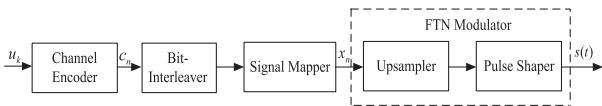

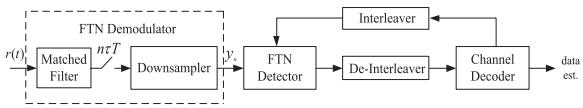  
(a) The FTN transmitter structure.   
(b) The FTN receiver structure.   
Fig. 1. The system model.

Ungerboeck observation model together with its CPL-avoiding proof. The basic idea of our method is to select the best $M$ states based on the MAP rule by taking some “future” symbols into account. Moreover, by noticing the importance of the key path of each possible state, we further propose a simplification of the proposed algorithm. Both the mathematical derivation and simulation results show that the proposed methods are able to detect FTN signals, and especially, the simplified algorithm is more suitable for FTN systems with higher order modulation formats, because of its low detection complexity. We evaluate the proposed methods in coded FTN systems with the use of convolutional codes and Turbo codes. Numerical results demonstrate that, compared to Nyquist modulations, significant gains in spectral efficiency or SNR can be obtained via utilizing FTN signaling.

The rest of this paper is organized as follows. We provide a system model of the FTN system in Section II. Then, in Section III, the proposed algorithms are presented along with the implementation procedures, the CPL-avoiding proof, and some analysis. Our numerical results are presented in Section IV, and finally a summary is provided in Section V.

# II. SYSTEM MODEL

Consider a baseband FTN system, whose transmitter structure is illustrated in Fig. 1(a). Assume that a sequence u of $K$ information bits is encoded using a channel code, generating a length- $N$ codeword $\mathbf { c } = [ c _ { 1 } , c _ { 2 } , \ldots , c _ { N } ] ^ { \mathrm { T } }$ with $c _ { i } \in \{ 0 , 1 \}$ . The codeword c is then permuted by a random bitinterleaver and delivered to the signal mapper. Assuming that we use binary phase shift keying (BPSK) signaling, a length- $. N$ symbol sequence1 $\mathbf { x } = [ x _ { 1 } , x _ { 2 } , \ldots , x _ { N } ] ^ { \mathrm { T } }$ with $x _ { n } \in \{ - 1 , + 1 \}$ is obtained. The $\mathbf { X }$ afterward feeds the FTN modulator which consists of an upsampler and a pulse shaper. The shaping pulse can be arbitrarily defined by a pulse $h ( t )$ , and in this paper, we consider the $T$ -orthogonal root raised cosine pulse (rRC) with a roll-off factor $\beta _ { \mathrm { r o l l - o f f } } ~ = ~ 0 . 3$ . The FTN signal $s ( t )$ is generated by mismatching the upsampling factor and the pulse sampling frequency, which, in other words, is a way to guarantee that the symbol rate is above the Nyquist criterion. In order to maintain the same power spectral density (PSD), the pulse has a time-truncation to $\pm 1 5 T$ around $t ~ = ~ 0$ .2

1In practical systems, a few more symbols are normally added to terminate the ISI trellis.   
$^ 2 \mathrm { I t }$ is shown in [14] that too-early truncation of the pulse leads to a significantly better minimum distance than the true FTN signals which results in a fake low bit error rate shown in the receiver.

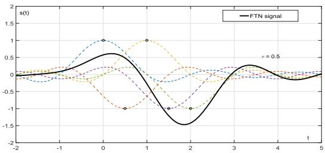  
Fig. 2. Sinc pulse linear modulation with $\tau = 0 . 5$ . The solid line represents the FTN signal, whereas the dotted lines represent pulses with the individual symbol.

In FTN systems, the symbol period $\tau T , \tau \ < \ 1$ is normally much shorter than that of orthogonal systems. Without loss of generality, an FTN signal can be expressed as

$$
s (t) = \sqrt {E _ {s} / T} \sum_ {n} x _ {n} h (t - n \tau T), \tag {1}
$$

where $E _ { s }$ is the average energy of modulation symbols. Fig. 2 offers an FTN signal with $\tau = 0 . 5$ and a sinc shaping pulse, where the transmitted symbols are $[ + 1 , - 1 , + 1 , - 1 , - 1 ] ^ { \mathrm { T } }$ . Assuming that $s \left( t \right)$ is transmitted over the AWGN channel, the received signal is given by $r \left( t \right) = s \left( t \right) + w \left( t \right)$ , where the white Gaussian noise $w \left( t \right)$ has one side PSD $N _ { 0 }$ . The FTN receiver structure is demonstrated in Fig. 1(b). The FTN demodulator includes a matched filter with a sampling rate-$1 / \tau T$ and a downsampler. The output of the FTN demodulator is a discrete-time sequence $\mathbf { y } = [ y _ { 1 } , y _ { 2 } , \ldots , y _ { N } ] ^ { \mathrm { T } }$ , which can be written as

$$
\mathbf {y} = \mathbf {G} \mathbf {x} + \boldsymbol {\eta}, \tag {2}
$$

where G is a Toeplitz matrix constructed by autocorrelation function samples $g _ { n }$ given as (3), as shown at the top of the next page.

Here, $L _ { \mathrm { I } }$ is the length of the ISI considered at the receiver, and

$$
g _ {n} = \int_ {- \infty} ^ {\infty} h (t) h ^ {*} (t - n \tau T) \mathrm {d} t, \tag {4}
$$

for any integer $- L _ { \mathrm { I } } \leq n \leq L _ { \mathrm { I } }$ , where $( \cdot ) ^ { * }$ denotes complex conjugation. The $\eta$ in (2) is the noise vector with zero-mean and the covariance matrix $\mathrm { E } [ \pmb { \eta } \pmb { \eta } ^ { \mathrm { H } } ] = ( N _ { 0 } / 2 ) \mathbf { G }$ , where $( \cdot ) ^ { \mathrm { H } }$ is the Hermitian (conjugate) transpose.

As a result, y has two properties: (1) the elements of y are correlated; (2) each individual symbol is colored-noisecorrupted. Note that since our algorithms are based on the Ungerboeck observation model, there is no need to apply the whitening filter in the receiver.

As shown in Fig. 1(b), we apply a Turbo-equalizationbased detection structure to pursue an approximate maximumlikelihood (ML) detection performance, where the log likelihood ratio (LLR) values are passed between the FTN detector and channel decoder. After several iterations, a sequence $\widehat { \textbf { u } }$ as the estimate of u can be found, which is regarded as the output for the receiver.

# III. REDUCED-COMPLEXITY EQUALIZATION STRATEGY BASED ON UNGERBOECK OBSERVATION MODEL

As the aforementioned system model implies, it is necessary to utilize the channel equalization. In this section we

discuss the design of channel equalizers with low-complexity. We would first like to clarify the notation we use in this section at first. We consider the trellis representation of ISI where the state at trellis section $n$ is defined as $\begin{array} { l l } { S _ { n } } & { { \stackrel { \Delta } { = } } } \end{array}$ $\left( x _ { n - L _ { \mathrm { I } } + 1 } , x _ { n - L _ { \mathrm { I } } + 2 } , \ldots , x _ { n } \right)$ . For brevity, we henceforth use $x _ { 1 } ^ { N }$ representing $[ x _ { 1 } , x _ { 2 } , \ldots , x _ { N } ] ^ { \mathrm { T } }$ . Thus, we define the ith possible path at section $n$ as $x _ { 1 } ^ { n - 1 } \left[ i \right]$ . Similarly, the i th possible state at the nth section is defined as $S _ { n } \left[ i \right]$ . The notation $\boldsymbol { \mathscr { X } } \left( \cdot \right)$ represents all the combinations of a certain set, and we let $q = \vert x \left( x \right) \vert$ represent the constellation size. Re $\{ \cdot \}$ is denoted as the real part of a complex number.

The channel observation model is a probabilistic representation of the underlying channel, and commonly, channel equalizers are dependent on the used channel observation model. The Ungerboeck observation model, which is also referred to as the matched filter model, is firstly derived by Ungerboeck based on the maximum-likelihood sequence estimation (MLSE) rule [25]. Similar to the Forney observation model, the Ungerboeck observation model enables a recursive probabilistic factorization of the form

$$
P (\mathbf {y} | \mathbf {x}) \propto \prod_ {n} \varphi (y _ {n}, \mathbf {x}), \tag {5}
$$

where

$$
\begin{array}{l} \varphi \left(y _ {n}, \mathbf {x}\right) = \varphi \left(y _ {n}, S _ {n}, S _ {n - 1}\right) \\ \triangleq \exp \left\{\frac {2}{N _ {0}} \operatorname {R e} \left\{x _ {n} ^ {*} \left(y _ {n} - \frac {1}{2} g _ {0} x _ {n} - \sum_ {l = 1} ^ {L _ {\mathrm {I}}} g _ {l} x _ {n - l}\right) \right\} \right\}, \tag {6} \\ \end{array}
$$

if $S _ { n - 1 }$ and $S _ { n }$ are connected through the trellis, or zero otherwise.

However, the Ungerboeck observation model did not attract much attention, and consequently the Turbo equalization operating on the Ungerboeck observation model was not available until 2005, when the BCJR algorithm based on the Ungerboeck observation model was first derived in [31].

Nonetheless, in FTN systems or other systems with very strong ISI, the optimum detection based on BCJR/Viterbi algorithm becomes prohibitively complex [8] which forces us to resort to suboptimal equalization methods. There are two common methods to achieve the reduced-complexity, named T-algorithm, and M-algorithm [32]. In this paper, we focus specifically on the M-algorithm-type of methods.

When operating on the trellis, M-algorithm aims to reduce the number of states to $M$ during each recursion in order to reduce the complexity of the equalization. Apparently, this type of methods depends highly on the selection of the M states. An error event will occur if the correct path is mistakenly eliminated from those states. Normally, we require that the correct path always has the largest metric to avoid error events.

Several authors have discussed this issue based on the Forney observation model. M-algorithm based Viterbi (M-Viterbi) algorithms were proposed in 1970s [33], and the best known one is [34]. In [34], at each trellis stage, the label selection takes all the ISI taps into account by jointly considering the influence of main states and offset states where main states

$$
\mathbf {G} = \left( \begin{array}{c c c c c c c c c} 1 & g _ {- 1} & \dots & g _ {- L _ {\mathrm {I}}} & 0 & 0 & 0 & 0 & \dots \\ g _ {1} & 1 & g _ {- 1} & \dots & g _ {- L _ {\mathrm {I}}} & 0 & 0 & 0 & \dots \\ \vdots & \ddots & \ddots & \ddots & & \ddots & & \ddots \\ g _ {L _ {\mathrm {I}}} & \dots & g _ {1} & 1 & g _ {- 1} & \dots & g _ {- L _ {\mathrm {I}}} & 0 & \dots \\ 0 & g _ {L _ {\mathrm {I}}} & \dots & g _ {1} & 1 & g _ {- 1} & \dots & g _ {- L _ {\mathrm {I}}} & \dots \\ \vdots & & \ddots & & \ddots & \ddots & \ddots & & \ddots \end{array} \right). \tag {3}
$$

are comprised by high energy symbols, and offset states are constructed by low energy symbols, respectively. This offset structure considers the feedback from the previous symbols while maintaining a relatively low complexity. Furthermore, this concept was extended to the BCJR-type algorithms, several studies appeared in the mid 1990s. In [35], Colavolpe et al. constructed a “survivor map” from main states and the corresponding offset states in each recursion, and then suitably combined the maps to generate a posteriori probabilities. In [14], the offset BCJR receiver shows very good performance even in a severe ISI case caused by FTN signaling where $\tau = 0 . 3 5$ . In [8] and [28], the M-algorithm is also considered for the Ungerboeck observation model. However, in order to deal with the CPL, the method always selects at least one state from all possible inputs regardless of their probabilities which may result in performance loss.

Commonly, for M-BCJR type of algorithms, states are reduced by recursively computing the $M$ most possible states at each trellis section from the previous $M$ nonzero values retained in $\alpha$ or $\beta$ , until the end of the recursion. However, this is not the best strategy for two reasons. Firstly, there is the recurring problem that the forward recursion and the backward recursion give different $M$ states even at the same trellis section which prohibits the detector from providing a surviving path. Secondly, at each recursion, the state probability computation lacks the involvement of the probabilities from the counterpart recursion, and consequently, this leads to the disobeying of the MAP rule, which is the reason for CPL issue with the use of the Ungerboeck M-BCJR. In the following, we offer a new M-BCJR type of algorithm that aims to solve the aforementioned issues. The proposed algorithm only needs one recursion and selects the $M$ states based on the MAP rule.

# A. Proposed Algorithm: MAP Symbol Detection on a Reduced Trellis

Based on the MAP rule, at trellis section $n$ , the set of M most possible states $S _ { n }$ should be determined by the a posteriori probability of each possible state $S _ { n } = s$ , which is

$$
P \left(S _ {n} = s \mid \mathbf {y}\right) = \frac {P \left(S _ {n} = s , \mathbf {y}\right)}{P (\mathbf {y})} \propto P \left(S _ {n} = s, \mathbf {y}\right). \tag {7}
$$

In order to implement the recursion calculation, we add sequence $x _ { 1 } ^ { n - 1 }$ into (7), yielding

$$
P \left(S _ {n} = s, y _ {1} ^ {N}\right) = \sum_ {\chi \left(x _ {1} ^ {n - 1}\right)} P \left(x _ {1} ^ {n - 1}, S _ {n} = s, y _ {1} ^ {N}\right). \tag {8}
$$

Based on the M-algorithm, we have

$$
P \left(S _ {n} = s, y _ {1} ^ {N}\right) \simeq \sum_ {i = 1} ^ {M} P \left(x _ {1} ^ {n - 1} [ i ], S _ {n} = s, y _ {1} ^ {N}\right), \tag {9}
$$

By considering (5) and the fact that $S _ { 0 } , S _ { 1 } , \ldots , S _ { n } , . . .$ is Markovian, we obtain

$$
\begin{array}{l} P (S _ {n} = s, y _ {1} ^ {N}) \\ \simeq \sum_ {i = 1} ^ {M} P \left(x _ {1} ^ {n - 1} [ i ], S _ {n} = s, y _ {1} ^ {n}, y _ {n + 1} ^ {N}\right) \\ = \sum_ {i = 1} ^ {M} P \left(x _ {1} ^ {n - 1} [ i ], S _ {n} = s, y _ {1} ^ {n}\right) P \left(y _ {n + 1} ^ {N} \mid S _ {n} = s, x _ {1} ^ {n - 1} [ i ], y _ {1} ^ {n}\right) \\ = \sum_ {i = 1} ^ {M} P \left(x _ {1} ^ {n - 1} [ i ], S _ {n} = s, y _ {1} ^ {n}\right) P \left(y _ {n + 1} ^ {N} \mid S _ {n} = s\right). \tag {10} \\ \end{array}
$$

The first term on the right-hand side of (10) is, in effect, the computation for the forward recursion of the Ungerboeck BCJR. As we require, for any $k = 1 , 2 , \ldots , N$ , the last state $S _ { k - 1 }$ in each $x _ { 1 } ^ { k - 1 } [ i ]$ has to be different, we then have

$$
\begin{array}{l} P \left(x _ {1} ^ {n - 1} [ i ], S _ {n} = s, y _ {1} ^ {n}\right) \\ = P \left(y _ {1} ^ {n} \mid x _ {1} ^ {n - 1} [ i ], x _ {n}\right) \prod_ {k = 1} ^ {n} P \left(\mathcal {S} _ {k} [ i ] \mid \mathcal {S} _ {k - 1} [ i ]\right) \\ \propto \prod_ {k = 1} ^ {n} \varphi \left(y _ {k}, S _ {k} [ i ], S _ {k - 1} [ i ]\right) P \left(x _ {k}\right), \tag {11} \\ \end{array}
$$

Fig. 3 shows an example of the forward recursion for BPSK systems with $M = 3$ , where $M$ individual paths contain $M$ different states at section $n - 1$ . At section $n$ , there are $2 M$ possible states induced by $S _ { n - 1 }$ in total.

For the second term on the right-hand side in (10), similar to the previous derivation, we get

$$
\begin{array}{l} P \left(y _ {n + 1} ^ {N} \mid S _ {n} = s\right) \\ = \sum_ {\mathcal {X} (x _ {n + 1} ^ {N})} P (y _ {n + 1} ^ {N}, x _ {n + 1} ^ {N} | S _ {n} = s) \\ = \sum_ {\chi (x _ {n + 1} ^ {N})} P \left(y _ {n + 1} ^ {N} \mid x _ {n} ^ {N}\right) P \left(x _ {n + 1} ^ {N} \mid S _ {n} = s\right) \\ \propto \sum_ {\chi \left(x _ {n + 1} ^ {N}\right)} \left\{\prod_ {k = 1} ^ {N - n} \varphi \left(y _ {n + k}, S _ {n + k}, S _ {n + k - 1}\right) P \left(x _ {n + k}\right) \right\}, \tag {12} \\ \end{array}
$$

which implies the computation can be done via a tree-like recursion as illustrated in Fig. 4, where each branch denotes

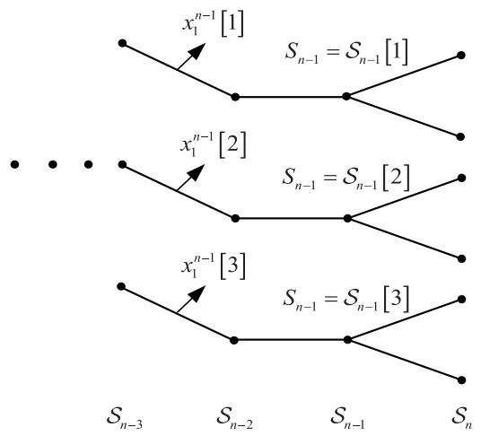  
Fig. 3. An example of the $\alpha$ computation for BPSK systems with $M = 3$ .

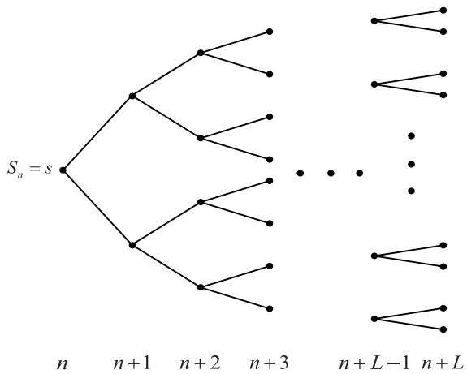  
Fig. 4. The tree-like structure rooted from $S _ { n } ~ = ~ s$ for $\beta$ computation for BPSK systems.

one possible combination of $x _ { n + 1 } ^ { N }$ . However, the complexity of traversing all combinations is too high, and as a matter of fact, the current trellis output is dominated by the current symbol and symbols within the time constraint. Normally, a subset x n+L n+1 $x _ { n + 1 } ^ { n + L }$ of $x _ { n + 1 } ^ { N }$ , can work very well where the value of parameter $L$ should be determined in terms of $\pmb { g }$ . We will give some instructions in the following subsection.

Based on the previous derivations, we make a conclusion here. We still use the same notation α, $\beta$ , and $\gamma$ as the classic BCJR does for forward recursion metric, backward recursion metric and branch metric, respectively. Then, for any $s ^ { \prime } \in S _ { n - 1 }$ and $s \in S _ { n }$ , γ should be

$$
\gamma_ {n} \left(S _ {n - 1} = s ^ {\prime}, S _ {n} = s\right) \triangleq \varphi \left(y _ {n}, s, s ^ {\prime}\right) P \left(x _ {n}\right). \tag {13}
$$

Similarly, $\alpha$ is given as

$$
\begin{array}{l} \alpha_ {n} (s) \triangleq \sum_ {i = 1} ^ {M} P \left(x _ {1} ^ {n - 1} [ i ], S _ {n} = s, y _ {1} ^ {n}\right) \\ \propto \sum_ {i = 1} ^ {M} \left\{\prod_ {k = 1} ^ {n} \varphi \left(y _ {k}, \mathcal {S} _ {k} [ i ], \mathcal {S} _ {k - 1} [ i ]\right) P \left(x _ {k}\right) \right\} \\ = \sum_ {s ^ {\prime} \in S _ {n - 1}} \alpha_ {n - 1} \left(s ^ {\prime}\right) \gamma_ {n} \left(S _ {n - 1} = s ^ {\prime}, S _ {n} = s\right). \tag {14} \\ \end{array}
$$

However, if we limit the backward search to $L$ symbols, then $\beta$ becomes

$$
\begin{array}{l} \beta_ {n} (s) \triangleq P \left(y _ {n + 1} ^ {N} \mid S _ {n} = s\right) \\ \propto \sum_ {\chi (x _ {n + 1} ^ {n + L})} \left\{\prod_ {k = 1} ^ {L} \varphi \left(y _ {n + k}, S _ {n + k}, S _ {n + k - 1}\right) P \left(x _ {n + k}\right) \right\} \\ = \sum_ {\chi \left(x _ {n + 1} ^ {n + L}\right)} \prod_ {k = 1} ^ {L} \gamma_ {n + k} \left(S _ {n + k - 1}, S _ {n + k}\right). \tag {15} \\ \end{array}
$$

In the end, the a posteriori probability of state $S _ { n } ~ = ~ s$ is given as

$$
\begin{array}{l} P \left(S _ {n} = s \mid y _ {1} ^ {N}\right) \propto \sum_ {s ^ {\prime} \in S _ {n - 1}} \alpha_ {n - 1} (s ^ {\prime}) \gamma_ {n} \left(S _ {n - 1} = s ^ {\prime}, S _ {n} = s\right) \beta_ {n} (s) \\ = \alpha_ {n} (s) \beta_ {n} (s), \tag {16} \\ \end{array}
$$

and the LLR value (if this is a binary case) is

$$
\begin{array}{l} L \left(x _ {n}\right) \triangleq \ln \frac {P \left(x _ {n} = + 1 \mid y _ {1} ^ {N}\right)}{P \left(x _ {n} = - 1 \mid y _ {1} ^ {N}\right)} \\ \sum P \left(S _ {n} = s, y _ {1} ^ {N}\right) \\ \simeq \ln \frac {s \in s _ {+ 1}}{\sum_ {s \in s _ {- 1}} P \left(S _ {n} = s , y _ {1} ^ {N}\right)}, \tag {17} \\ \end{array}
$$

where $s _ { + 1 }$ and $s _ { - 1 }$ represent the states induced by input $x _ { n } = + 1$ and $x _ { n } = - 1$ , respectively. With the a posteriori probability of each $S _ { n }$ , it is straightforward to choose the $M$ most possible states, thus $S _ { n }$ is easy to obtain.

As the derivation implies, the proposed algorithm only needs one forward recursion, and it is straightforward for it to be extended to the M-BCJR based on the Forney observation model. As an example, detailed implementation procedures of the proposed algorithm for BPSK signaling are given in the following subsection, and procedures for other modulation formats are quite similar.

# B. Detailed Procedures of the Proposed Algorithm for BPSK Signaling

We require the trellis to be terminated, so that the recursion starts and ends in state 0 (all $+ 1$ symbols). The inputs to the algorithm are the matched filter outputs $\mathbf { y }$ and their corresponding a priori probabilities. The outputs are the LLR values of transmitted symbols.

• Initialization:   
Set $\mathcal { S } _ { 0 } \left[ i \right] = 0$ , and $\alpha _ { 0 } [ i ] = 1$ , for all $i \in \{ 1 , 2 , \dots M \}$ .   
• Forward Recursion:

For $n = 1$ to $N$ , perform the following computations:

1) Compute $\alpha _ { n }$ from the $M$ states retained in $S _ { n - 1 }$ with the corresponding values in $\alpha _ { n - 1 }$ by using (14). Note that if the merging of the trellis path happens during this step, one may simply leave one survivor with the probability as the sum of all the same states and remove the others, in order to maintain the individuality of the different paths. For those states that are not in $S _ { n - 1 }$ , their probabilities are assumed to be zero. Thus, all the possible $S _ { n }$ are found.

2) For each $S _ { n }$ , compute $\beta _ { n }$ by using (15).   
3) Use (16) to compute the a posteriori probability of each $S _ { n }$ .   
4) Compute $L ( x _ { n } )$ in terms of (17). Meanwhile, the M most possible survivor paths are found by the comparison of their a posteriori probabilities. If the number of all possible paths is less than $M$ , all the paths should be reserved. The last state of each path are reserved in $S _ { n }$ .   
5) Set $n = n + 1$ .

# C. Further Discussion:The CPL-Avoiding Proof

We now show that our algorithm is able to avoid the CPL. Without loss of generality, we first consider the case of $M = 1$ By substituting (14) and (15) into (16), we have

$$
P \left(S _ {n} = s, y _ {1} ^ {N}\right) \propto \sum_ {X \left(x _ {n + 1} ^ {n + L}\right)} \left\{\prod_ {k = 1} ^ {n + L} \varphi \left(y _ {k}, S _ {k}, S _ {k - 1}\right) P \left(x _ {k}\right) \right\}, \tag {18}
$$

which is in fact the sum of $q ^ { L }$ metrics for the possible paths of length $n + L$ that are extended from $x _ { 1 } ^ { n }$ .

To avoid confusion and for notational brevity, we use $x _ { 1 } ^ { n }$ to denote the correct path of length $n$ . Let $\mathbf { v } = \mathbf { \bar { \Phi } } _ { x _ { 1 } } ^ { n + L } + e _ { 1 } ^ { n + L }$ L + en+L represent one of the possible paths of length n+ L, where en+L1 $n { \mathrel { + { L } } }$ $e _ { 1 } ^ { n + L }$ is an error sequence. With the respect of the derivation in [29] and the assumption that transmitted symbols are equiprobably taking values in $\chi ( x )$ , 3 the metric of path $\mathbf { V }$ is

$$
\begin{array}{l} J (\mathbf {v}) = \operatorname {R e} \left\{\left(x _ {1} ^ {n + L} + e _ {1} ^ {n + L}\right) ^ {\mathrm {H}} y _ {1} ^ {n + L} - \frac {1}{2} \left\| x _ {1} ^ {n + L} + e _ {1} ^ {n + L} \right\| ^ {2} \right. \\ \left. - \left(x _ {1} ^ {n + L} + e _ {1} ^ {n + L}\right) ^ {\mathrm {H}} \mathbf {G} _ {\mathrm {L} (n + L) \times (n + L)} \left(x _ {1} ^ {n + L} + e _ {1} ^ {n + L}\right) \right\}. \tag {19} \\ \end{array}
$$

where ${ \mathbf { G } } _ { \mathrm { L } _ { ( n + L ) \times ( n + L ) } }$ represents the lower triangular matrix of G with zeros on the main diagonal. For brevity, we define $A \overset { \Delta } { = } \left( n + L \right) \times \left( n + L + L _ { \mathrm { I } } \right)$ and $B \ { \overset { \Delta } { = } } \ ( n + L ) \times ( n + L )$ . Recall (2), we then have

$$
\begin{array}{l} J (\mathbf {v}) = \operatorname {R e} \left\{\left(x _ {1} ^ {n + L} + e _ {1} ^ {n + L}\right) ^ {\mathrm {H}} \mathbf {G} _ {\mathrm {U} _ {\mathrm {A}}} x _ {1} ^ {n + L + L _ {\mathrm {I}}} \right. \\ - \left(x _ {1} ^ {n + L}\right) ^ {\mathrm {H}} \mathbf {G} _ {\mathrm {L B}} e _ {1} ^ {n + L} - \frac {1}{2} d ^ {2} \left(e _ {1} ^ {n + L}\right) - \frac {1}{2} \left\| x _ {1} ^ {n + L} \right\| ^ {2} \\ \left. - \left(e _ {1} ^ {n + L}\right) ^ {\mathrm {H}} x _ {1} ^ {n + L} + \left(x _ {1} ^ {n + L} + e _ {1} ^ {n + L}\right) ^ {\mathrm {H}} \eta_ {1} ^ {n + L} \right\}, \tag {20} \\ \end{array}
$$

where $\mathbf { G } _ { \mathrm { U _ { A } } }$ is the upper triangular matrix of size $A$ with unit main diagonal, and $\bar { d } ^ { \bar { 2 } } ( e _ { 1 } ^ { n + L } )$ is the squared Euclidean distance between the erroneous path and the correct path which is equal to

$$
\begin{array}{l} d ^ {2} \left(e _ {1} ^ {n + L}\right) = \left(e _ {1} ^ {n + L}\right) ^ {\mathrm {H}} \mathbf {G} e _ {1} ^ {n + L} \\ = 2 \operatorname {R e} \left\{\left(e _ {1} ^ {n + L}\right) ^ {\mathrm {H}} \mathbf {G} _ {\mathrm {L}} e _ {1} ^ {n + L} \right\} + \left\| e _ {1} ^ {n + L} \right\| ^ {2}. \tag {21} \\ \end{array}
$$

Therefore, similar to the ideas in [29], if there exists another possible path ${ \bf v } ^ { \prime } ~ = ~ x _ { 1 } ^ { n + L } + e _ { 1 } ^ { \prime n + L }$ L + en+L1 , • with a different error

3This leads to an MLSE case, and the proof for the MAP case is very similar.

sequence $e _ { \mathrm { ~ 1 ~ } } ^ { \prime n + L }$ , the difference between the metrics of the two paths becomes

$$
\begin{array}{l} J \left(\mathbf {v} ^ {\prime}\right) - J (\mathbf {v}) \\ = \operatorname {R e} \left\{\left(m _ {1} ^ {n + L}\right) ^ {\mathrm {H}} \mathbf {T} x _ {n + L + 1} ^ {n + L + L _ {1}} \right. \\ \left. - \left(m _ {1} ^ {n + L}\right) ^ {\mathrm {H}} \mathbf {G} \left(e _ {1} ^ {n + L} + \frac {1}{2} m _ {1} ^ {n + L}\right) + \left(m _ {1} ^ {n + L}\right) ^ {\mathrm {H}} \eta_ {1} ^ {n + L} \right\}, \tag {22} \\ \end{array}
$$

where $m _ { 1 } ^ { n + L } = e _ { \mathrm { ~ 1 ~ } } ^ { \prime n + L } - e _ { 1 } ^ { n + L }$ e and $\mathbf { T }$ is of size $( n + L ) \times L _ { \mathrm { I } }$ given by

$$
\mathbf {T} = \left( \begin{array}{c c c c c} 0 & 0 & 0 & \dots & 0 \\ \vdots & \vdots & \vdots & & \vdots \\ 0 & 0 & 0 & \dots & 0 \\ g _ {- L _ {\mathrm {I}}} & 0 & 0 & \dots & 0 \\ g _ {- (L _ {\mathrm {I}} - 1)} & g _ {- L _ {\mathrm {I}}} & 0 & \dots & 0 \\ \vdots & \ddots & \ddots & & \vdots \\ g _ {- 2} & g _ {- 3} & \dots & g _ {- L _ {\mathrm {I}}} & 0 \\ g _ {- 1} & g _ {- 2} & \dots & g _ {- (L _ {\mathrm {I}} - 1)} & g _ {- L _ {\mathrm {I}}} \end{array} \right). \tag {23}
$$

Now let us focus on the CPL issue. We claim the CPL happens when the following equation is satisfied in the $M = 1$ case which is

$$
\ln \frac {P \left(S _ {n} = s ^ {\prime} , y _ {1} ^ {N}\right)}{P \left(S _ {n} = s , y _ {1} ^ {N}\right)} > 0, \tag {24}
$$

where $S _ { n } = s ^ { \prime }$ is an incorrect state induced by an error sequence $e _ { 1 } ^ { n } = \{ 0 , 0 , \ldots , e _ { n } \} ^ { \mathrm { T } }$ , while $S _ { n } = s$ is the correct state generated from the path $x _ { 1 } ^ { n }$ . Further analysis of this issue needs following conclusions.

Theorem 1 (The Correct Tail Path): We claim that $\mathbf { v }$ is the correct tail path if and only if the last $L$ elements are correct which is $e _ { n + 1 } ^ { n + L } = \mathbf { 0 } ^ { \mathrm { T } }$ . Then for the correct tail paths $\left\{ \mathbf { v } _ { 1 } , \mathbf { v } _ { 2 } , \ldots , \mathbf { v } _ { q } \right\}$ for the possible states $\left\{ s _ { 1 } , s _ { 2 } , \ldots , s _ { q } \right\}$ at section $n$ and any integer $1 \leq k \leq q$ , we have

$$
P \left(S _ {n} = s _ {k}, y _ {1} ^ {N}\right) \propto \theta \exp \left(\frac {2}{N _ {0}} J \left(\mathbf {v} _ {k}\right)\right), \tag {25}
$$

where $\theta$ is a variable that is independent from $e _ { 1 } ^ { n }$

Proof: The proof is given in Appendix A.

Theorem 1 gives a different insight of the backward recursion in which the backward recursion is an attempt to find the correct tail path. Thus, if the backward recursion is a kind of reduced search of the whole tree-like structure, the method is still able to offer an accurate a posteriori probability of the current input, as long as the correct tail path is found.

Corollary 1 (The Correct Tail Path in Practice): For the states $S _ { n } = s ^ { \prime }$ and $S _ { n } = s$ induced by two correct tail paths at section $n$ , say $\mathbf { v } ^ { \prime }$ and v, we have

$$
\ln \frac {P \left(S _ {n} = s ^ {\prime} , y _ {1} ^ {N}\right)}{P \left(S _ {n} = s , y _ {1} ^ {N}\right)} = \frac {2}{N _ {0}} \left[ J \left(\mathbf {v} ^ {\prime}\right) - J (\mathbf {v}) \right]. \tag {26}
$$

Proof: The Corollary can be directly obtained by using Theorem 1. Thus, the proof is omitted here.

With the help of Corollary 1, the following derivations are easy to obtain. By choosing the path pair $\mathbf { \bar { v } } ~ = ~ x _ { 1 } ^ { n + L }$ and

$\mathbf { v } ^ { \prime } = x _ { 1 } ^ { n + L } + e _ { 1 } ^ { n + L }$ , where $e _ { 1 } ^ { n + L } = ( 0 , 0 , \cdots , e _ { n } , 0 , \cdots , 0 ) ^ { \mathrm { T } }$ and $e _ { n } \neq 0$ , we then get

$$
\begin{array}{l} \ln \frac {P \left(S _ {n} = s ^ {\prime} , y _ {1} ^ {N}\right)}{P \left(S _ {n} = s , y _ {1} ^ {N}\right)} \\ = \frac {2}{N _ {0}} \left\{\operatorname {R e} \left\{e _ {n} ^ {*} \left(\sum_ {l = L + 1} ^ {L _ {\mathrm {I}}} g _ {- l} x _ {n + l} + \eta_ {n}\right) - \frac {1}{2} | e _ {n} | ^ {2} \right\} \right\}. \tag {27} \\ \end{array}
$$

Thus, in the noiseless regime, taking BPSK signaling as an example, where the error symbols belong to a ternary alphabet $e _ { n } \in \{ - 2 , 0 , 2 \}$ . By substituting (27) into (24) and noticing the fact that $g _ { - i } = g _ { i } ^ { * }$ , we have

$$
- x _ {n} \sum_ {l = L + 1} ^ {L _ {1}} g _ {l} x _ {n + l} - 1 > 0. \tag {28}
$$

The left-hand side of (28) can be maximized with $x _ { n + l } ~ =$ $- x _ { n } g _ { l } / \left| g _ { l } \right|$ , and then we finally obtain the condition for a CPL to occur as

$$
\sum_ {l = L + 1} ^ {L _ {1}} | g _ {l} | > 1. \tag {29}
$$

Proposition 1 (The Choice of L for CPL-Free Performance for BPSK Signaling With $\begin{array} { l l l } { { M } } & { { = } } & { { 1 , } } \end{array}$ ): In the absence of noise, for BPSK signaling with a certain ISI pattern $\pmb { g }$ , to achieve CPL-free performance with $M = 1$ , $L$ should satisfy $\scriptstyle \sum _ { l = L + 1 } ^ { L _ { \mathrm { I } } } | g _ { l } | < 1$ .

With Proposition 1, it is obvious that in the case of $M = 1$ , a proper value of $L$ ensures CPL-free performance for BPSK signaling. Similar conclusions can be obtained for other modulation formats.

Now let us focus on the case in which $M > 1$ . Clearly, when $\pmb { g }$ does not satisfy the condition in Proposition 1, a larger M is required to achieve error-free performance. Therefore, it is still necessary to discuss if the algorithm will still perform well when the erroneous paths are mistakenly reserved at the previous trellis stage. For this, we define

$$
M ^ {\prime} \triangleq \sup  _ {n, e _ {1} ^ {n}} \left| \varepsilon \left(e _ {1} ^ {n}\right) \right|, \tag {30}
$$

where $\varepsilon \left( e _ { 1 } ^ { n } \right)$ represents the set of error patterns that cause CPL and it is formally defined as

$$
\varepsilon \left(e _ {1} ^ {n}\right) \triangleq \left\{e _ {1} ^ {n}: J \left(x _ {1} ^ {n} + e _ {1} ^ {n}\right) - J \left(x _ {1} ^ {n}\right) > 0 \right\}. \tag {31}
$$

Thus, we have the following Theorem.

Theorem 2 (The Condition for $M ^ { \prime } = 0$ for BPSK Signaling): In the absence of noise, for BPSK signaling with a certain ISI pattern $\pmb { g }$ , if

$$
2 \sum_ {l = 1} ^ {L _ {1} - L} l \left| g _ {- (L + l)} \right| - \frac {1}{2} d _ {\min } ^ {2} <   0, \tag {32}
$$

holds, then $M ^ { \prime } = 0$ . $d _ { \operatorname* { m i n } } ^ { 2 }$ is the minimum squared Euclidean distance of any error pattern.

Proof: The proof is given in Appendix B.

In the case where $M ^ { \prime } = 0$ , the algorithm with $M \ = \ 1$ is performed error-free since the correct path always has the largest metric. Also, in the case where $M ^ { \prime } > 0$ , the algorithm will not suffer CPL as long as $M > M ^ { \prime } { + } 1$ , because the correct path is always included in the best $M$ paths and thus reserved. Note that, in practice, the reduced trellis may not have the certain error pattern that arises CPL, thus when $M < M ^ { \prime } + 1$ , the algorithm does not necessarily fail. Meanwhile, Theorem 2 implies the close relationship between $L$ and $M$ wherein a larger value of $L$ enables a smaller value of $M$ , and vice versa. Hence, in practice, it is possible to use a larger $M$ in place of a larger $L$ to reduce the complexity. Theorem 2 can be extended to other modulation formats, and similar conclusions can be obtained.

With Proposition 1 and Theorem 2, it is obvious that proper choices of $M$ and $L$ ensures CPL-free performance, and thus the proof is complete. Notice that Proposition 1 and Theorem 2 are similar to the conclusions in [29], as our algorithm is an extension from the original M-BCJR algorithm.

# D. Remarks on the Proposed Algorithm

As we can see in the derivation for $\beta$ in (15), to compute $\beta$ , the complexity is exponential in $q$ . There are some natural extensions to further reduce the complexity. A detailed complexity analysis is offered in Section IV.

1) In fact, at each section the $\beta$ computation traces forward through some states that are already measured by the previous search. This repeating search enlightens us to save the probabilities of $\{ S _ { n + L } \}$ rooted from $S _ { n }$ after each $\beta$ computation and use them in the next section. This method can be seen as a tree-split process where the $\beta$ computation at section $n + 1$ is, in fact, the subtrees of the whole tree-like structure described in Fig. 4. Thus the number of states of each $\beta$ is exactly $q ^ { L }$ and since there is no reduction during the $\beta$ computation, the performance remains the same.

2) The LLR values passing between the signal detector and the channel detector are of great importance for the Turbo equalization system. Fertonani et al. pointed out that the M-algorithm degrades the LLR quality and the countermeasure is to use a parameter with a proper value to limit the absolute value of LLRs [36]. We adopt this idea and provide an equivalent method which is to adjust the noise variance in the whole computation process. This method is more direct than the previous method because this can be interpreted as treating part of the ISI energy as noise. EXIT chart [37] analysis shows a fine value of $N _ { 0 }$ allows a smaller $L$ , however in some cases few more iterations are needed. In fact, (2is $\begin{array} { r } { E _ { s } \sum _ { l = L + 1 } ^ { L _ { \mathrm { I } } } | g _ { l } | ^ { 2 } + N _ { 0 } / 2 } \end{array}$ e of the nois, and when $L$ plus ISI energyis sufficiently large, the above variance degrades to $N _ { 0 } / 2$ .

We would also like to make a comparison with the reducedstate equalizer proposed in [38]. The main difference between the two methods is that the reduced-state equalizer in [38] is based on the channel shortening process, where three filters have to be designed in order to facilitate the method

operating on the “shortened” channel. Besides that, the trellissearch process in [38] implements the reduced-state BCJR by removing part of the ISI tails with the use of decision-feedback from the survival path on each state, which is different from selecting the $M$ best paths from all possible paths at each stage as in this paper. It is also worth mentioning that the Jacobian approximation in [38] limits the number of the branches connecting to the former state to one. The condition of such operation in terms of finding the correct input of current section is, as mentioned in [29], $\begin{array} { r } { \sum _ { l = 1 } ^ { L _ { \mathrm { I } } } \left| g _ { l } \right| - \mathrm { \hat { 1 } } > 0 } \end{array}$ . On the other hand, our method can always find the correct tail path without any limit on $\pmb { g }$ .

Although our algorithm only has a forward recursion, which is different from the classical BCJR algorithm, we still believe our method belongs to the M-BCJR category. This is because the backward recursion still exists in the whole process. In our method, the traditional backward recursion is separated into several parts corresponding to the possible states at each trellis section, as implied by (15). Similar to M-BCJR type algorithms, the $\alpha$ and $\beta$ together decide the final estimation of inputs. Hence, we believe it is fair to call our method a type of M-BCJR algorithm.

# E. Simplification for the Proposed Algorithm

The exponential complexity of computing $\beta$ is the drawback of the proposed algorithm, which motivates us to find a solution to reduce the complexity. Recall Theorem 1, which implies that for computing $\beta$ , there exists a method of the same detection performance by only calculating the metric of the correct tail path. Thus, the problem now is to find the correct tail path, for which we give the following Theorem.

Theorem 3 (The Region for the Correct Tail Path Having the Largest Metric for BPSK Signaling): In the absence of noise, for BPSK signaling, no matter what state, there is always a region $\mathcal { R }$ of $\pmb { g }$ , in which the correct tail path has the largest metric. Furthermore, there exists a subset $\mathcal { R } ^ { \prime } \subset \mathcal { R }$ , where

$$
\mathcal {R} ^ {\prime} = \left\{\boldsymbol {g} \left| 3 \sum_ {i = 1} ^ {L _ {\mathrm {I}}} | g _ {- i} | + \sum_ {j = 1} ^ {L - 1} | g _ {- j} | <   1 \right. \right\}. \tag {33}
$$

Proof: The proof is given in Appendix C.

Clearly, within the region $\mathcal { R }$ , it is possible to find the correct tail path by calculating all the metrics of the paths from a random state at the current section and then compute $\beta$ based on the correct tail path for other states. As an example, Fig. 5 shows the probability of finding the correct tail path for BPSK signaling in terms of the compression factor $\tau$ and $L$ in the absence of noise. The simulation includes all the possible input combinations and error patterns, and thus it is representative. It is worth mentioning that the limit of $\mathcal { R } ^ { \prime }$ in terms of $\pmb { g }$ is around $\tau \ = \ 0 . 9$ . However, as shown in the figure, for the case $\tau = 0 . 8$ , the correct tail path is still the best-metric path. Meanwhile, when the value of $L$ is higher, the correct tail path tends to be more difficult to find. The intuitive explanation for this is that a larger $L$ results in more possible error patterns, within which finding a certain path is more difficult. A mathematical view for this issue has already

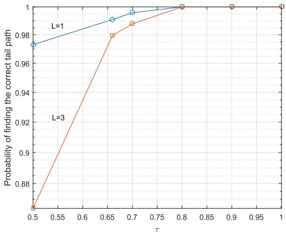  
Fig. 5. The probability of finding the correct tail path for BPSK signaling in terms of the compression factor $\tau$ and $L$ in the absence of noise.

been shown in Theorem 3, as a larger $L$ leads to a smaller region $\mathcal { R } ^ { \prime }$ for a certain $\pmb { g }$ . Note that, in practice, there are other factors that have an impact on finding the correct tail path, such as the size of the reduced trellis, the size of the constellation, the extrinsic information, the input sequence, etc..

Once the correct tail path is found, $\beta$ is easily obtained. Since the simplification only changes the $\beta$ calculation, we only give the new procedure of the $\beta$ calculation in the following, and the rest of steps of the simplified algorithm remain the same as the original algorithm.

The Step (2) for the Simplified Algorithm: Find a possible state $\begin{array} { l l l } { S _ { n } } & { = } & { s } \end{array}$ , compute all the metrics of the paths $( \mathbf { v } _ { 1 } , \mathbf { v } _ { 2 } , \ldots \mathbf { v } _ { k } , \ldots , \mathbf { v } _ { q ^ { L } } )$ ) extended from $s$ by the following equation,

$$
J \left(\mathbf {v} _ {k}\right) = \prod_ {k = 1} ^ {L} \varphi \left(y _ {n + k}, S _ {n + k}, S _ {n + k - 1}\right) P \left(x _ {n + k}\right). \tag {34}
$$

Mark the path that has the largest metric as the correct tail path $\mathbf { v } = \hat { x } _ { n + 1 } ^ { n + L }$ . Then compute all $\beta _ { n } \left( s \right)$ by using

$$
\beta_ {n} (s) = \exp \left(\frac {2}{N _ {0}} \prod_ {k = 1} ^ {L} \varphi \left(y _ {n + k}, S _ {n + k}, S _ {n + k - 1}\right) P \left(\hat {x} _ {n + k}\right)\right), \tag {35}
$$

where $S _ { n } = s$ and $S _ { n + k }$ is induced by $\hat { x } _ { n + k }$ from the previous state $S _ { n + k - 1 }$ .

Fig. 6 shows an example of $\beta$ calculation for the simplified algorithm with $M = 2$ , $L = 2$ and BPSK signaling, where the thick red lines are the selected correct tail paths that are reserved for calculating the probabilities of all possible states at the nth stage. As shown in the figure, the correct tail path is selected after computing all possible paths that are extended from a random state, and the probabilities of other states are given by calculating the metric of the correct tail path starting from the corresponding state. The numerical results and some complexity analysis for the simplified algorithm are given in Section IV.

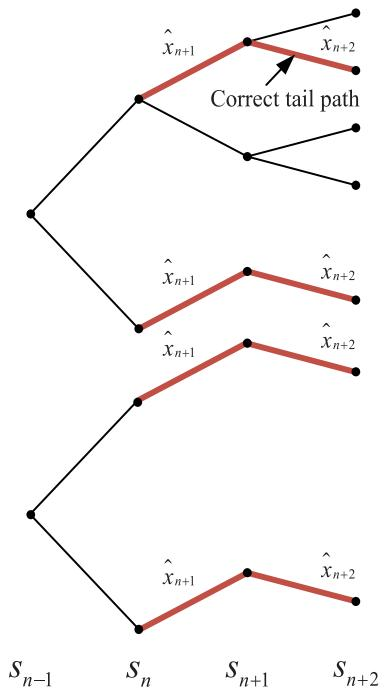  
Fig. 6. An example of $\beta$ calculation for the simplified algorithm with $M = 2$ , $L = 2$ and BPSK signaling, where the thick red lines are the selected correct tail paths that are reserved for calculating the probabilities of all possible states at the nth stage.

# F. Comparison Between Proposed Algorithms

In this subsection, we would like to make a comparison between the original algorithm and simplified algorithm. Both algorithms select M dominant states at each trellis section and only need one forward recursion which includes an $\alpha$ computation and $\beta$ computation. The difference between algorithms is that the original algorithm requires a full-complex $\beta$ computation whereas the simplified algorithm only computes the metric of a certain path for $\beta$ computation by selecting the correct tail path. Clearly, the complexity of $\beta$ computation for the simplified algorithm is much less than that of the original algorithm. However, the simplified algorithm can only work in a certain range of ISI, the condition of which is offered in the previous subsection. Meanwhile, since the complexity increases very little with the growth of $M$ and the fact that the correct tail path is easy to be found if $L$ is small, the simplified algorithm indicates the idea of using a larger $M$ to replace the need of a larger $L$ . But a larger $M$ in return makes finding the correct tail path more difficult, and thus, in practice, the parameters of the simplified algorithm should be determined based on the actual situation.

# IV. NUMERICAL RESULTS

In this section, we investigate the BER performance of the coded FTN system with the two proposed algorithms as well as their complexity. For the original algorithm, we perform the BPSK modulation with two kinds of channel codes: convolutional codes and Turbo codes. For the simplified algorithm, we evaluate the performance of convolutional coded systems with 16-QAM. All simulation results for the original algorithm are generated based on Section III-B, and all algorithms

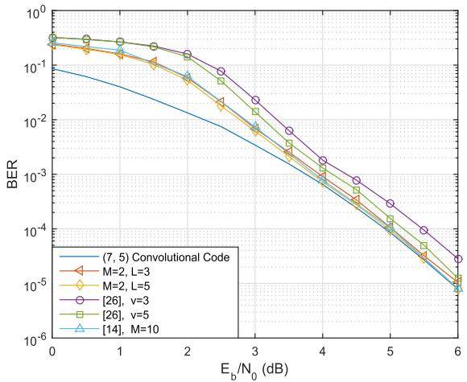  
Fig. 7. BER results of the BPSK modulated FTN system with (7, 5) convolutional code for $\tau = 0 . 5$ and 5 Turbo iterations.

are implemented in logarithmic domain in order to maintain stability. Without loss of generality, the normalized spectral efficiency $\eta$ is defined as the ratio of the two-dimensional information rate and the transmission bandwidth, given by

$$
\eta = \frac {(K / N) \cdot \log_ {2} (q)}{(1 + \beta_ {\text {r o l l - o f f}}) \tau} \cdot \frac {2}{D}, \tag {36}
$$

where $D$ is the dimension of the modulation format. For the two systems with $\mathrm { B E R } < 1 0 ^ { - 5 }$ , we further define the normalized spectral efficiency gain brought by FTN signaling as

$$
\mathrm{gain} \triangleq \frac {\eta_ {\mathrm {FTN}} - \eta_ {\mathrm {ORTH}}}{\eta_ {\mathrm {ORTH}}} \times 100 \%, \tag{37}
$$

where $\eta _ { \mathrm { F T N } }$ and ηORTH are the normalized spectral efficiency of the FTN system and orthogonal system, respectively.

# A. Numerical Results for the Original Algorithm

Anderson et al. found that some convolutional codes are more suitable for coded FTN systems than others [39]. Here, we use the (7, 5) 4-state rate-1/2 nonrecursive convolutional code, which is one of those those more suitable codes. We set the length of information sequence as $K = 6 0 0 0$ , and perform simulations in two scenarios, which are $\tau \ : = \ : 0 . 5$ and $\tau =$ 0.35, respectively. For comparison, we also perform methods in [14] and [26].

The BER results for the case of $\tau = 0 . 5$ are illustrated in Fig. 7, where a normalized spectral efficiency gain of $100 \%$ is obtained by FTN signaling. As the figure implies, with 5 Turbo iterations, our method with $M = 2$ , $L = 3$ and $M = 2$ , $L = 5$ outperforms the method in [26] with $\upsilon = 3$ and $v = 5$ , respectively, and BER results of our method converge to the no-ISI curve at around 4 dB. The method in [14] with $M = 1 0$ has a similar performance to our method with $M = 2$ , $L = 5$ . However, the receiver for the method in [14] normally requires 3 or 4 filters and the method itself needs 3 recursions.

For the severe ISI case $\tau ~ = ~ 0 . 3 5$ with the normalized spectral efficiency gain of $186 \%$ , the BER results are shown in Fig. 8. In this case, it is necessary to consider many ISI coefficients in order to approximate the channel well, which

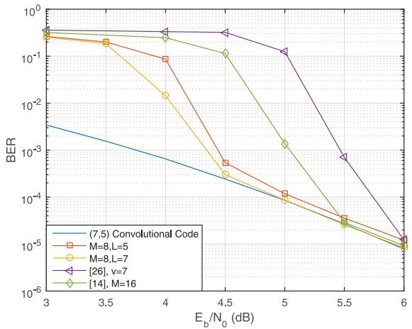  
Fig. 8. BER results of the BPSK modulated FTN system with (7, 5) convolutional code for $\tau = 0 . 3 5$ and 15 Turbo iterations.

implies a larger value for parameter $L$ is needed. However, with the purpose of maintaining a relatively low complexity, here we use a larger $M$ instead. With 15 Turbo iterations, the BER result of our method with $M = 8$ and $L = 5$ converges at around 5 dB which clearly outperforms the method in [26] with $\upsilon \ : = \ : 7$ . Meanwhile, a larger $L$ indeed brings a better performance. The performance of our method with $M = 8$ and $L = 7$ reaches the no-ISI situation at $4 . 5 \ \mathrm { d B }$ , which is 1 dB better than that of the method in [14] with $M = 1 6$ .

Now let us consider the Turbo coded FTN systems. Besides a proper detection method, a good code design and a suitable scheduling strategy for the detector are also of great importance. Note that the Turbo iteration detection aims for no-ISI error performance with the help of proper extrinsic information from the channel decoder which implies, for coded FTN systems, the channel code should be constructed in a way such that it provides a good enough no-ISI performance and an early converge for ISI systems at the same time. Thus, an asymmetric Turbo code structure is a fair solution, where one of the component codes offers a “friendly” circumstance for the ISI, while the other one has a relatively stronger error correcting ability. This idea is slightly different from the idea of [40], where they use a weak constituent code to achieve a better BER curve at very small SNR, while combining it with a strong constituent code to obtain a good BER performance at larger SNR. In our case, only a better BER curve at very small SNR is not sufficient; it must also be “friendly” enough to FTN systems which enlightens us once again using the results from [39]. Hence, in the following simulation, we utilize the generator polynomial of the two component codes for the FTN Turbo codes (FTN TC) as

$$
g _ {1} (D) \triangleq \left[ 1 \frac {1 + D + D ^ {2}}{1 + D ^ {2}} \right],
$$

$$
g _ {2} (D) \triangleq \left[ 1 \frac {1 + D + D ^ {3}}{1 + D ^ {2} + D ^ {3}} \right], \tag {38}
$$

where $g _ { 1 } ( D )$ is a “good” recursive systematic code (RSC) suggested in [39], and $g _ { 2 } ( D )$ is the generator polynomial for Turbo codes in 3GPP W-CDMA systems, respectively.

The structure of the receiver for Turbo coded FTN system is illustrated in Fig. 9,4 where uk ,uk ,c (1)k ,c (2)k $u _ { k } , u _ { k } ^ { \prime } , c _ { k } ^ { ( 1 ) } , c _ { k } ^ { ( 2 ) }$ are denoted as the kth information bit, the kth inner interleaved information bit as well as the $k$ th check bits from the two RSCs, respectively, and Le uk , c (1)k , c (2)k $L _ { e } \left( u _ { k } , c _ { k } ^ { ( 1 ) } , c _ { k } ^ { ( 2 ) } \right)$ represents the corresponding marginal extrinsic information of uk , c (1)k $u _ { k }$ $\boldsymbol { c } _ { k } ^ { ( 1 ) }$ and $\boldsymbol { c } _ { k } ^ { ( 2 ) }$ . Based on the structure, we give a brief description here. The outputs y from the FTN demodulator together with the extrinsic information generated from the two RSC decoders are sent to the FTN detector, whose outputs are de-interleaved and then fed to the two RSC decoders. After each individual decoding, the extrinsic information has to be correspondingly reunited and then feeds back to the FTN detector. Note that for each RSC decoder, the two inputs are part of the FTN detector outputs and the extrinsic information of information bits that are generated from the other RSC decoder.

The BER curves of Turbo coded FTN systems are shown in Fig. 10, where the information sequence is of length $K \ : = \ : 2 1 8 4 2$ , the code rate $R = 1 / 3$ , and codeword length $N = 6 5 5 3 6$ including 10 redundant bits to terminate the trellis. In the figure, the FTN TC is referred to as the Turbo code whose generator polynomial is given in (38), and is tested with different compression factors. We use the new receiver diagram and the original algorithm to decode the FTN TC, where $M \ = \ 8$ and $L \ = \ 5$ , except for the orthogonal case $\tau = 1$ . As a comparison, the BER curves of W-CDMA Turbo codes operating in the orthogonal system (Orthogonal TC) are also illustrated in Fig.10, whose spectral efficiencies are the same as those of FTN TCs. The two W-CDMA Turbo codes are of the same codeword length $N = 6 5 5 3 8$ with 12 more bits for trellis termination but with different code rates. Without loss of generality, all the simulations have a maximum iteration number $I _ { \mathrm { m a x } } = 5 0$ , and are finished if the two RSC decoders both give exactly the same data estimation uˆ .

Due to the use of weak constituent code, the error floor of the proposed FTN TC appears at an early stage when $\tau = 1$ . However, with the decrease of $\tau$ , the advantage of FTN TC shows up. When $\tau = 2 / 3$ , the data rate of the whole FTN system increases to the same as that of the Nyquist system with a code of rate $R = 1 / 2$ , but as we can see from the figure, the FTN TC achieves a gain about 0.3 dB compared to the Orthogonal TC and the gap from the Shannon limit for binary inputs is also about 0.3 dB. The advantage becomes more obvious when $\tau = 1 / 2$ , the gain becomes about 0.4 dB and the gap decreases to only about 0.25 dB. In fact, there is still a potential to further improve the FTN TC design. By exhaustive search and EXIT chart study, it is possible to give a generator polynomial of the FTN TC with an even better performance.

# B. Numerical Results for the Simplified Algorithm

The BER results of the simplified algorithm for detecting 16-QAM FTN systems are shown in Fig. 11. We still use the same outer code with $K \ = \ 6 0 0 0$ as for the original algorithm but with 10 Turbo iterations. For the case $\tau = 2 / 3$ ,

4This is not the only scheme with good performance, but this one is suitable for most cases. The strategy towards scheduling is a future topic for us.

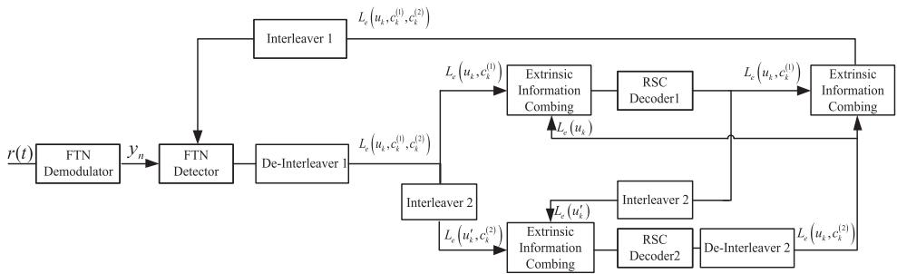  
Fig. 9. The new receiver structure for the Turbo coded FTN system.

TABLE I COMPUTATIONAL LOAD ANALYSIS OF $\tau = 0 . 8$ IN FIG. 11   

<table><tr><td>Algorithm</td><td>Additions</td><td>LUT accesses</td><td>Recursion/Self-iteration times</td></tr><tr><td>Simplified Algorithm, M=4, L=3</td><td>25396</td><td>12541</td><td>1</td></tr><tr><td>[27], LE=4</td><td>15872</td><td>1552</td><td>50</td></tr></table>

TABLE II COMPLEXITY ANALYSIS FOR PROPOSED METHODS   

<table><tr><td>Algorithm</td><td>Observation model</td><td>States per symbol</td><td>Recursion(s)</td><td>Filter(s)</td></tr><tr><td>Original Algorithm</td><td>Ungerboeck</td><td>Mq qL+1-1q-1</td><td>1</td><td>1</td></tr><tr><td>Simplified Algorithm</td><td>Ungerboeck</td><td>qL+1-1q-1+(L+1)×(Mq-1)</td><td>1</td><td>1</td></tr><tr><td>BCJR</td><td>Ungerboeck</td><td>qL1</td><td>2</td><td>1</td></tr><tr><td>Channel shortening in [26]</td><td>Ungerboeck</td><td>qv</td><td>2</td><td>2</td></tr><tr><td>M-BCJR in [14]</td><td>Forney</td><td>Mq</td><td>3</td><td>3 or 4</td></tr></table>

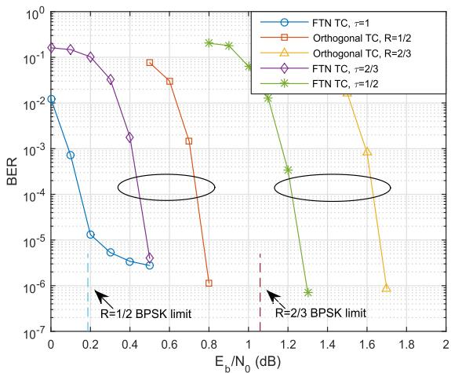  
Fig. 10. BER results of the Turbo coded FTN system with different $\tau$ values and Turbo coded orthogonal system with different data rates. The FTN TC is referred to as the Turbo code with generator polynomial given in (38) and the Orthogonal TC is referred to as the Turbo code used in W-CDMA systems, respectively.

the normalized spectral efficiency is the same as that of the 64-QAM system with the same channel code. However, with the help of the simplified algorithm, 4.5 dB advantage is obtained. To gain a better understanding, the method in [27] with $L _ { E } = 4$ and 50 self-iterations is also performed in the case of $\tau \ = \ 0 . 8$ . As the figure implies, our method with $M = 4$ , $L = 3$ exhibits a similar performance to the method in [27] in all SNR regions. However, as shown in table I, our method requires less complexity. The analysis includes the times of additions and access to a look-up table (LUT) per symbol and per iteration as well as the times of recursions or self-iterations. Clearly, our method needs more computational

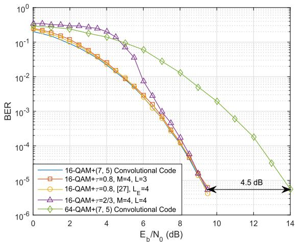  
Fig. 11. BER of the 16-QAM modulated FTN system with (7, 5) convolutional code, comparing the simplified algorithm with 10 Turbo iterations for different $\tau$ values.

load per symbol and per iteration. However, our method only requires one recursion which implies the total complexity requirement for our method is less than that of the method in [27].

# C. Complexity Analysis

We offer a detailed complexity analysis in this subsection. The analysis in terms of the observation model, the states per symbol, the required recursions and the number of filters at the receiver is shown in table II. As shown in the table, the number of states for the original algorithm is linear in $M$ and exponential in $L$ . Based on the previous analysis, it is possible to substitute the large $L$ by a larger $M$ in order to reduce the complexity. Similarly, for the simplified algorithm,

since the complexity increases less with the growth of $M$ , the complexity can also be reduced by choosing a larger $M$ instead of a larger L. Furthermore, both of the proposed algorithms only require one recursion and one filter at the receiver that is the matched filter. Hence, based on the performance and complexity analysis, proposed algorithms offer the flexibility of choosing the required parameters and a good trade-off between performance and complexity.

# V. CONCLUSION

In this paper, we have proposed two new reducedcomplexity equalization algorithms based on the Ungerboeck observation model, and the BER results show very good and robust performance under the ISI circumstances induced by FTN signaling. Both algorithms are extended from the traditional M-BCJR algorithms by considering some “future” symbols. We have proven that the proposed algorithms are able to avoid the issue of CPL by investigating the path metrics. Complexity analysis about the algorithms has also been given which indicates that our algorithms provide a good trade-off between performance and complexity.

# APPENDIX A

# PROOF OF THEOREM 1

Recall (18), where each $S _ { n }$ includes $q ^ { L }$ different paths, we have

$$
P \left(S _ {n} = s, y _ {1} ^ {N}\right) \propto \sum_ {i = 1} ^ {q ^ {L}} \exp \left[ \frac {2}{N _ {0}} J \left(\mathbf {v} _ {i}\right) \right], \tag {39}
$$

where $\mathbf { v } _ { i }$ represents an individual path from $S _ { n } = s$ . Without loss of generality, we assume the path $\mathbf { v } _ { k }$ is the correct tail path. We then have

$$
\begin{array}{l} P \left(S _ {n} = s, y _ {1} ^ {N}\right) \\ \propto \exp \left[ \frac {2}{N _ {0}} J (\mathbf {v} _ {k}) \right] \times \sum_ {i = 1} ^ {q ^ {L}} \exp \left\{\frac {2}{N _ {0}} [ J (\mathbf {v} _ {i}) - J (\mathbf {v} _ {k}) ] \right\}, \tag {40} \\ \end{array}
$$

Let us focus on $J ( \mathbf { v } _ { i } ) - J ( \mathbf { v } _ { k } )$ , since both $\mathbf { v } _ { i }$ and $\mathbf { v } _ { k }$ are the paths from the same state $S _ { n } = s$ . It is obvious that the first $n$ sections of the two paths are exactly the same. Also, because $\mathbf { v } _ { k }$ has the correct tail, it ensures n+L $e _ { n + 1 } ^ { \bar { n } + L } = \mathbf { 0 } ^ { \mathrm { T } }$ . Thus, (22) can further be simplified. We get

$$
\begin{array}{l} J \left(\mathbf {v} _ {i}\right) - J \left(\mathbf {v} _ {k}\right) \\ = \operatorname {R e} \left\{\left(m _ {n + 1} ^ {n + L}\right) ^ {\mathrm {H}} \mathbf {T} _ {1} x _ {n + L + 1} ^ {n + L + L _ {\mathrm {I}}} - \left(m _ {n + 1} ^ {n + L}\right) ^ {\mathrm {H}} \mathbf {G} _ {L \times L} \left(\frac {1}{2} m _ {n + 1} ^ {n + L}\right) \right. \\ \left. + \left(m _ {n + 1} ^ {n + L}\right) ^ {\mathrm {H}} \eta_ {n + 1} ^ {n + L} \right\}, \tag {41} \\ \end{array}
$$

where the value of $\mathbf { T } _ { 1 }$ is given in (42), as shown at the top of the next page.

The error sequence $e _ { 1 } ^ { n + L }$ is no longer part of the equation 1 and the only variable in (41) is $m _ { n + 1 } ^ { n + \bar { L } }$ . Hence, since the $q ^ { L }$ possible combinations of $m _ { n + 1 } ^ { n + L }$ n 1 from each $S _ { n }$ are all included in the calculation, we can safely draw the conclusion here that

$\begin{array} { r } { \sum _ { i = 1 } ^ { q ^ { L } } \exp \left\{ \frac { 2 } { N _ { 0 } } \left[ J \left( \mathbf { v } _ { i } \right) - J \left( \mathbf { v } _ { k } \right) \right] \right\} = \theta } \end{array}$ , where $\theta$ is a variable 0 that is independent from $e _ { 1 } ^ { n }$ and $m _ { n + 1 } ^ { n + L }$

This completes the proof of Theorem 1.

# APPENDIX B

# PROOF OF THEOREM 2

Consider the probability calculation of the correct state $S _ { n } = s$ and the wrong state $S _ { n } = s ^ { \prime }$ in the noiseless regime, we have

$$
\ln \frac {P \left(S _ {n} = s ^ {\prime} , y _ {1} ^ {N}\right)}{P \left(S _ {n} = s , y _ {1} ^ {N}\right)} \propto \sum_ {i = 1} ^ {q ^ {L}} J \left(\mathbf {v} _ {i} ^ {\prime}\right) - J (\mathbf {v} _ {i}), \tag {43}
$$

where $\mathbf { v } _ { i } ^ { \prime }$ and $\mathbf { v } _ { i }$ represent the i th path of the probability calculation for $S _ { n } = s ^ { \prime }$ and $S _ { n } = s$ , respectively. Since $\mathbf { v } _ { i } ^ { \prime }$ and $\mathbf { v } _ { i }$ have the same error pattern $e _ { n + 1 } ^ { n + L }$ , further simplification of (43) is possible, we have

$$
\ln \frac {P \left(S _ {n} = s ^ {\prime} , y _ {1} ^ {N}\right)}{P \left(S _ {n} = s , y _ {1} ^ {N}\right)} \propto q ^ {L} \times \operatorname {R e} \left\{\left(e _ {1} ^ {n}\right) ^ {\mathrm {H}} \mathbf {T} _ {2} x _ {n + L + 1} ^ {n + L _ {1}} - \frac {1}{2} d ^ {2} \left(e _ {1} ^ {n}\right) \right\}, \tag {44}
$$

where

$$
\mathbf {T} _ {2} = \left( \begin{array}{c c c c} 0 & 0 & \dots & 0 \\ \vdots & & & \\ 0 & & & \vdots \\ g _ {- L _ {\mathrm {I}}} & 0 & & \\ g _ {- (L _ {\mathrm {I}} - 1)} & g _ {- L _ {\mathrm {I}}} & \ddots & \\ \vdots & & \ddots & 0 \\ g _ {- (L + 1)} & g _ {- (L + 2)} & \dots & g _ {- L _ {\mathrm {I}}} \end{array} \right). \tag {45}
$$

Obviously, for BPSK signaling, (44) can be upper-bounded by

$$
\begin{array}{l} q ^ {L} \times \operatorname {R e} \left\{\max  _ {e _ {1} ^ {n}, x _ {n + L + 1} ^ {n + L _ {1}}} \left\{\left(e _ {1} ^ {n}\right) ^ {\mathrm {H}} \mathbf {T} _ {2} x _ {n + L + 1} ^ {n + L _ {1}} \right\} - \frac {1}{2} \min  _ {e _ {1} ^ {n}} \left\{d ^ {2} \left(e _ {1} ^ {n}\right) \right\} \right\} \\ <   q ^ {L} \times \left[ 2 \sum_ {l = 1} ^ {L _ {1} - L} l \left| g _ {- (L + l)} \right| - \frac {1}{2} d _ {\min } ^ {2} \right]. \tag {46} \\ \end{array}
$$

This completes the proof of Theorem 2.

# APPENDIX C

# PROOF OF THEOREM 3

Consider a wrong state at section $n$ with an error sequence $e _ { 1 } ^ { n }$ . We are interested in the metrics of correct tail path and other possible paths within the $\beta$ calculation. Without loss of generality, we define the correct tail path as $\mathbf { v } \triangleq x _ { 1 } ^ { n + L } + e _ { 1 } ^ { n + L }$  + e1 , where $e _ { 1 } ^ { n + L } = { \Big ( } { \big ( } e _ { 1 } ^ { n } { \big ) } ^ { \mathrm { T } } , \mathbf { 0 } { \Big ) } ^ { \mathrm { T } }$ , and a possible path that does not have the correct tail as $\mathbf { v ^ { \prime } } \triangleq { { x _ { 1 } ^ { n + L } } } + { e _ { \mathrm { ~ 1 ~ } } ^ { \prime } } ^ { n + L }$ , where ${ e _ { \mathrm { ~ 1 ~ } } ^ { \prime } } ^ { n + L } =$ $\left( \left( e _ { 1 } ^ { n } \right) ^ { \mathrm { T } } , \left( e _ { n + 1 } ^ { n + L } \right) ^ { \mathrm { T } } \right) ^ { \mathrm { T } }$ . Thus, we have

$$
\begin{array}{l} J \left(\mathbf {v} ^ {\prime}\right) - J (\mathbf {v}) \\ = \operatorname {R e} \left\{\left(e _ {n + 1} ^ {n + L}\right) ^ {\mathrm {H}} \mathbf {T} _ {1} x _ {n + L + 1} ^ {n + L + L _ {1}} - \left(e _ {n + 1} ^ {n + L}\right) ^ {\mathrm {H}} \mathbf {G} ^ {\prime} \left(e _ {n - L _ {1} + 1} ^ {n} + \frac {1}{2} e _ {n + 1} ^ {n + L}\right) \right. \\ \left. + \left(e _ {n + 1} ^ {n + L}\right) ^ {\mathrm {H}} \eta_ {n + 1} ^ {n + L} \right\}, \tag {47} \\ \end{array}
$$

$$
\mathbf {T} _ {1} = \left( \begin{array}{c c c c c c c} g - L & g _ {- (L + 1)} & \dots & g _ {- L _ {\mathrm {I}}} & 0 & \dots & 0 \\ \vdots & \ddots & & & \ddots & & \vdots \\ g - 2 & \dots & g - L & g _ {- (L + 1)} & \dots & g _ {- L _ {\mathrm {I}}} & 0 \\ g - 1 & g - 2 & \dots & g - L & g _ {- (L + 1)} & \dots & g _ {- L _ {\mathrm {I}}} \end{array} \right). \tag {42}
$$

$$
\mathbf {G} ^ {\prime} = \left( \begin{array}{c c c c c c c} g _ {L _ {1}} & g _ {L _ {1} - 1} & \dots & 1 & \dots & g _ {- (L - 2)} & g _ {- (L - 1)} \\ 0 & g _ {L _ {1}} & g _ {L _ {1} - 1} & \dots & 1 & \dots & g _ {- (L - 2)} \\ \vdots & \ddots & \ddots & & & \ddots & \vdots \\ 0 & \dots & 0 & g _ {L _ {1}} & g _ {L _ {1} - 1} & \dots & 1 \end{array} \right). \tag {48}
$$

$$
\mathbf {M} = \left( \begin{array}{c} {\left(g _ {- L} ^ {- L _ {1}}\right) ^ {\mathrm {T}} x _ {n + L + 1} ^ {n + L _ {1} + 1} - \left(g _ {- 1} ^ {- (L - 1)}\right) ^ {\mathrm {T}} e _ {n + 2} ^ {n + L} - \left(g _ {L _ {1}} ^ {1}\right) ^ {\mathrm {T}} e _ {n - L _ {1} + 1} ^ {n}} \\ {\left(g _ {- (L - 1)} ^ {- L _ {1}}\right) ^ {\mathrm {T}} x _ {n + L + 1} ^ {n + L _ {1} + 2} - \left(g _ {- 1} ^ {- (L - 2)}\right) ^ {\mathrm {T}} e _ {n + 3} ^ {n + L} - \left(g _ {L _ {1}} ^ {2}\right) ^ {\mathrm {T}} e _ {n - L _ {1} + 2} ^ {n}} \\ \vdots \\ {\left(g _ {- 2} ^ {- L _ {1}}\right) ^ {\mathrm {T}} x _ {n + L + 1} ^ {n + L _ {1} + L - 1} - g _ {- 1} e _ {n + L} - \left(g _ {L _ {1}} ^ {L - 1}\right) ^ {\mathrm {T}} e _ {n - L _ {1} + L - 1} ^ {n}} \\ {\left(g _ {- 1} ^ {- L _ {1}}\right) ^ {\mathrm {T}} x _ {n + L + 1} ^ {n + L _ {1} + L} - 0 - \left(g _ {L _ {1}} ^ {L}\right) ^ {\mathrm {T}} e _ {n - L _ {1} + L} ^ {n}} \end{array} \right). \tag {52}
$$

where the value of $\mathbf { G } ^ { \prime }$ is given in (48), as shown at the top of this page.

In the absence of noise, by considering the matrix partition $\mathbf { G } ^ { \prime } = \left[ \mathbf { T } _ { 3 } \quad \mathbf { G } _ { L \times L } \right]$ , in which

$$
\mathbf {T} _ {3} = \left( \begin{array}{c c c c c c} g _ {L _ {\mathrm {I}}} & g _ {L _ {\mathrm {I}} - 1} & & \dots & & g _ {1} \\ 0 & g _ {L _ {\mathrm {I}}} & & \dots & & g _ {2} \\ \vdots & \ddots & \ddots & & & \vdots \\ 0 & \dots & 0 & g _ {L _ {\mathrm {I}}} & \dots & g _ {L} \end{array} \right), \tag {49}
$$

we obtain

$$
\begin{array}{l} J \left(\mathbf {v} ^ {\prime}\right) - J (\mathbf {v}) \\ = \operatorname {R e} \left\{\left(e _ {n + 1} ^ {n + L}\right) ^ {\mathrm {H}} \mathbf {T} _ {1} x _ {n + L + 1} ^ {n + L + L _ {1}} - \left(e _ {n + 1} ^ {n + L}\right) ^ {\mathrm {H}} \mathbf {T} _ {3} e _ {n - L _ {1} + 1} ^ {n} \right. \\ \left. - \frac {1}{2} \left(e _ {n + 1} ^ {n + L}\right) ^ {\mathrm {H}} \mathbf {G} _ {L \times L} e _ {n + 1} ^ {n + L} \right\}. \tag {50} \\ \end{array}
$$

We believe that slightly abusing the notation is acceptable, thus by noticing the partition $\mathbf { G } = \left[ \mathbf { G } _ { L } \ \textbf { I } \ \mathbf { G } _ { L } ^ { \mathrm { H } } \right]$ , we get

$$
J \left(\mathbf {v} ^ {\prime}\right) - J (\mathbf {v}) = \operatorname {R e} \left\{\left(e _ {n + 1} ^ {n + L}\right) ^ {\mathrm {H}} \mathbf {M} - \frac {1}{2} \sum_ {i = 1} ^ {L} \left| e _ {n + i} \right| ^ {2} \right\}, \tag {51}
$$

where M is given in (52), as shown at the top of this page.

Obviously, if we denote $M _ { k }$ as the $k$ th element of M, (51) can be upper-bounded by

$$
\begin{array}{l} J (\mathbf {v} ^ {\prime}) - J (\mathbf {v}) \\ <   \sum_ {k = 1} ^ {L} \max  _ {e _ {n - L _ {\mathrm {I}} + k} ^ {n}, e _ {n + k} ^ {n + L}, x _ {n + L + 1} ^ {n + L _ {\mathrm {I}} + k}} \left\{\operatorname {R e} \left\{(e _ {n + k}) ^ {*} M _ {k} - \frac {1}{2} | e _ {n + k} | ^ {2} \right\} \right\}. \tag {53} \\ \end{array}
$$

Hence, the problem becomes finding the certain region, where

$$
\max  _ {e _ {n - L _ {1} + k} ^ {n}, e _ {n + k} ^ {n + L}, x _ {n + L + 1} ^ {n + L _ {1} + k}} \left\{\operatorname {R e} \left\{(e _ {n + k}) ^ {*} M _ {k} - \frac {1}{2} | e _ {n + k} | ^ {2} \right\} \right\} <   0 \tag {54}
$$

always holds for any integer $1 \ \leq \ k \ \leq \ L$ . By noticing the error symbols alphabet $\{ - 2 , 0 , 2 \}$ for BPSK signaling, (54) be further upper-bounded as

$$
\begin{array}{l} \max_{\substack{x^{n + L_{1} + k}\\ x_{n + L + 1}}}\operatorname {Re}\left\{\left(g^{-L_{1}}_{-L + k - 1}\right)^{T}x^{n + L_{1} + 1}_{n + L + 1}\right\} \\ -\min_{\substack{e^{n + L}\\ e_{n + k + 1}}}\operatorname {Re}\left\{\left(g^{-(L - k)}\right)^{\mathrm{T}}e^{n + L}_{n + k + 1}\right\} \\ - \min  _ {e _ {n - L _ {\mathrm {I}} + k} ^ {n}} \operatorname {R e} \left\{\left(g _ {L _ {\mathrm {I}}} ^ {k}\right) ^ {\mathrm {T}} e _ {n - L _ {\mathrm {I}} + k} ^ {n} \right\} <   1. \tag {55} \\ \end{array}
$$

Clearly, the second term on the left-hand side is able to generate a larger value than the first term. Hence, the maximum value on the left-hand side appears when $k = 1$ . Thus, by noticing $| g _ { i } | = | g _ { - i } |$ , we can obtain the condition for (55) as

$$
3 \sum_ {i = 1} ^ {L _ {1}} | g _ {- i} | + \sum_ {j = 1} ^ {L - 1} | g _ {- j} | <   1. \tag {56}
$$

Note that it is not possible for all the elements in (56) to get the maximum value or minimum value at the same time, and thus we have $\mathcal { R } ^ { \prime } \subset \mathcal { R }$ . This completes the proof of Theorem 3.

# ACKNOWLEDGMENT

The authors would like to thank the editor and the anonymous reviewers for their comments which helped to significantly improve the manuscript. The authors also wish to thank Prof. Xiao Ma for the fruitful discussion. The authors are also grateful to Rachel Madin and Marian Phillips for their constructive suggestions.

# REFERENCES

[1] J. E. Mazo, “Faster-than-Nyquist signaling,” Bell Syst. Tech. J., vol. 54, no. 8, pp. 1451–1462, Oct. 1975.   
[2] J. B. Anderson, F. Rusek, and V. Öwall, “Faster-than-Nyquist signaling,” Proc. IEEE, vol. 101, no. 8, pp. 1817–1830, Aug. 2013.

[3] J. B. Anderson, “Faster-than-Nyquist signaling for 5G communication,” in Signal Processing for 5G: Algorithms and Implementations. Hoboken, NJ, USA: Wiley, 2016, pp. 24–46.   
[4] J. Fan, S. Guo, X. Zhou, Y. Ren, G. Y. Li, and X. Chen, “Faster-than-Nyquist signaling: An overview,” IEEE Access, vol. 5, pp. 1925–1940, 2017.   
[5] G. Colavolpe, T. Foggi, A. Modenini, and A. Piemontese, “Faster-than-Nyquist and beyond: How to improve spectral efficiency by accepting interference,” Opt. Exp., vol. 19, no. 27, pp. 26600–26609, Dec. 2011.   
[6] W. Ryan and S. Lin, Channel Codes: Classical and Modern. Cambridge, U.K.: Cambridge Univ. Press, 2009.   
[7] F. Rusek and J. B. Anderson, “Constrained capacities for faster-than-Nyquist signaling,” IEEE Trans. Inf. Theory, vol. 55, no. 2, pp. 746–775, Feb. 2009.   
[8] F. Rusek, “Partial response and faster-than-Nyquist signaling,” Ph.D. dissertation, Dept. Elect. Inf. Technol., Lund Univ., Lund, Sweden, 2007.   
[9] F. Rusek and J. B. Anderson, “The two dimensional Mazo limit,” in Proc. IEEE Int. Symp. Inf. Theory, Adelaide, SA, Australia, Sep. 2005, pp. 970–974.   
[10] F. Rusek and J. B. Anderson, “Multistream faster than Nyquist signaling,” IEEE Trans. Commun., vol. 57, no. 5, pp. 1329–1340, May 2009.   
[11] A. Barbieri, D. Fertonani, and G. Colavolpe, “Time-frequency packing for linear modulations: Spectral efficiency and practical detection schemes,” IEEE Trans. Commun., vol. 57, no. 10, pp. 2951–2959, Oct. 2009.   
[12] A. Piemontese, A. Modenini, G. Colavolpe, and N. S. Alagha, “Improving the spectral efficiency of nonlinear satellite systems through timefrequency packing and advanced receiver processing,” IEEE Trans. Commun., vol. 61, no. 8, pp. 3404–3412, Aug. 2013.   
[13] G. Colavolpe and T. Foggi, “Time-frequency packing for highcapacity coherent optical links,” IEEE Trans. Commun., vol. 62, no. 8, pp. 2986–2995, Aug. 2014.   
[14] A. Prlja and J. B. Anderson, “Reduced-complexity receivers for strongly narrowband intersymbol interference introduced by faster-than-Nyquist signaling,” IEEE Trans. Commun., vol. 60, no. 9, pp. 2591–2601, Sep. 2012.   
[15] G. Forney, “Maximum-likelihood sequence estimation of digital sequences in the presence of intersymbol interference,” IEEE Trans. Inf. Theory, vol. IT-18, no. 3, pp. 363–378, May 1972.   
[16] S. Sugiura and L. Hanzo, “Frequency-domain-equalization-aided iterative detection of faster-than-Nyquist signaling,” IEEE Trans. Veh. Technol., vol. 64, no. 5, pp. 2122–2128, May 2015.   
[17] F. Rusek and J. B. Anderson, “Non binary and precoded faster than Nyquist signaling,” IEEE Trans. Commun., vol. 56, no. 5, pp. 808–817, May 2008.   
[18] C. Le, M. Schellmann, M. Fuhrwerk, and J. Peissig, “On the practical benefits of faster-than-Nyquist signaling,” in Proc. IEEE Int. Conf. Adv. Technol. Commun. (ATC), Hanoi, Vietnam, Oct. 2014, pp. 208–213.   
[19] J.-A. Lucciardi, N. Thomas, M.-L. Boucheret, C. Poulliat, and G. Mesnager, “Trade-off between spectral efficiency increase and PAPR reduction when using FTN signaling: Impact of non linearities,” in Proc. IEEE Int. Conf. Commun. (ICC), Kuala Lumpur, Malaysia, May 2016, pp. 1–7.   
[20] M. El Hefnawy and H. Taoka, “Overview of faster-than-Nyquist for future mobile communication systems,” in Proc. IEEE veh. Technol. Conf. (VTC Spring), Dresden, Germany, Jun. 2013, pp. 1–5.   
[21] N. Pham, J. B. Anderson, F. Rusek, J.-M. Freixe, and A. Bonnaud, “Exploring faster-than-Nyquist for satellite direct broadcasting,” in Proc. AIAA Int. Commun. Satellite Syst. Conf., Florence, Italy, Oct. 2013, pp. 14–17.   
[22] P. Banelli, S. Buzzi, G. Colavolpe, A. Modenini, F. Rusek, and A. Ugolini, “Modulation formats and waveforms for 5G networks: Who will be the heir of OFDM?: An overview of alternative modulation schemes for improved spectral efficiency,” IEEE Signal Process. Mag., vol. 31, no. 6, pp. 80–93, Nov. 2014.   
[23] G. D. Forney, Jr., and G. Ungerboeck, “Modulation and coding for linear Gaussian channels,” IEEE Trans. Inf. Theory, vol. 44, no. 6, pp. 2384–2415, Oct. 1998.   
[24] A. Prlja, J. B. Anderson, and F. Rusek, “Receivers for faster-than-Nyquist signaling with and without turbo equalization,” in Proc. IEEE Int. Symp. Inf. Theory, Toronto, ON, Canada, Jul. 2008, pp. 464–468.   
[25] G. Ungerboeck, “Adaptive maximum-likelihood receiver for carriermodulated data-transmission systems,” IEEE Trans. Commun., vol. COM-22, no. 5, pp. 624–636, May 1974.

[26] F. Rusek and A. Prlja, “Optimal channel shortening for MIMO and ISI channels,” IEEE Trans. Wireless Commun., vol. 11, no. 2, pp. 810–818, Feb. 2012.   
[27] G. Colavolpe, D. Fertonani, and A. Piemontese, “SISO detection over linear channels with linear complexity in the number of interferers,” IEEE J. Sel. Topics Signal Process., vol. 5, no. 8, pp. 1475–1485, Dec. 2011.   
[28] F. Rusek, M. Loncar, and A. Prlja, “A comparison of Ungerboeck and Forney models for reduced-complexity ISI equalization,” in Proc. IEEE Global Telecommun. Conf. (GLOBECOM), Washington, DC, USA, Nov. 2007, pp. 1431–1436.   
[29] M. Loncar and F. Rusek, “On reduced-complexity equalization based on Ungerboeck and Forney observation models,” IEEE Trans. Signal Process., vol. 56, no. 8, pp. 3784–3789, Aug. 2008.   
[30] F. Rusek, G. Colavolpe, and C. E. W. Sundberg, “40 years with the Ungerboeck model: A look at its potentialities [lecture notes],” IEEE Signal Process. Mag., vol. 32, no. 3, pp. 156–161, May 2015.   
[31] G. Colavolpe and A. Barbieri, “On MAP symbol detection for ISI channels using the Ungerboeck observation model,” IEEE Commun. Lett., vol. 9, no. 8, pp. 720–722, Aug. 2005.   
[32] V. Franz and J. B. Anderson, “Concatenated decoding with a reducedsearch BCJR algorithm,” IEEE J. Sel. Areas Commun., vol. 16, no. 2, pp. 186–195, Feb. 1998.   
[33] J. Anderson and J. Bodie, “Tree encoding of speech,” IEEE Trans. Inf. Theory, vol. IT-21, no. 4, pp. 379–387, Jul. 1975.   
[34] A. Duel-Hallen and C. Heegard, “Delayed decision-feedback sequence estimation,” IEEE Trans. Commun., vol. 37, no. 5, pp. 428–436, May 1989.   
[35] G. Colavolpe, G. Ferrari, and R. Raheli, “Reduced-state BCJR-type algorithms,” IEEE J. Sel. Areas Commun., vol. 19, no. 5, pp. 848–859, May 2001.   
[36] D. Fertonani, A. Barbieri, and G. Colavolpe, “Reduced-complexity BCJR algorithm for turbo equalization,” IEEE Trans. Commun., vol. 55, no. 12, pp. 2279–2287, Dec. 2007.   
[37] S. ten Brink, “Convergence behavior of iteratively decoded parallel concatenated codes,” IEEE Trans. Commun., vol. 49, no. 10, pp. 1727–1737, Oct. 2001.   
[38] S. Hu, H. Kröll, Q. Huang, and F. Rusek, “Optimal channel shortener design for reduced- state soft-output Viterbi equalizer in singlecarrier systems,” IEEE Trans. Commun., vol. 65, no. 6, pp. 2568–2582, Jun. 2017.   
[39] J. B. Anderson and M. Zeinali, “Best rate 1/2 convolutional codes for turbo equalization with severe ISI,” in Proc. IEEE Int. Symp. Inf. Theory, Cambridge, MA, USA, Jul. 2012, pp. 2366–2370.   
[40] P. C. Massey and D. J. Costello, Jr., “New developments in asymmetric Turbo codes,” in Proc. 2nd Int. Symp. Turbo Codes, Brest, France, Sep. 2000, pp. 93–100.

Shuangyang Li received the B.S. and M.S. degree from Xidian University, China, in 2013 and 2016, respectively. He is currently pursuing the Ph.D. degree with the State Key Laboratory of Integrated Services Networks, School of Telecommunication Engineering, Xidian University, China. His research interests include signal processing, channel coding, and their applications to communication systems.

Baoming Bai (S’98–M’00) received the B.S. degree from the Northwest Telecommunications Engineering Institute, China, in 1987, and the M.S. and Ph.D. degrees in communication engineering from Xidian University, China, in 1990 and 2000, respectively. From 2000 to 2003, he was a Senior Research Assistant with the Department of Electronic Engineering, City University of Hong Kong. Since 2003, he has been with the State Key Laboratory of Integrated Services Networks, School of Telecommunication Engineering, Xidian University, where he is cur-

rently a Professor. In 2005, he was with the University of California at Davis, Davis, as a Visiting Scholar. His research interests include information theory and channel coding, wireless communication, and quantum communication.

Peiyao Chen (S’17) received the B.S. degree from Xidian University, China, in 2014, where she is currently pursuing the Ph.D. degree with the State Key Laboratory of Integrated Services Networks. Her research interests include channel coding, modulation, and their applications to communication systems.

Jing Zhou received the Ph.D. degree from the Beijing University of Posts and Telecommunications, Beijing, China, in 2013. He is currently a Post-Doctoral Research Associate with the Department of Electronic Engineering and Information Science, University of Science and Technology of China. His research interest includes digital communications, information theory, and optical wireless communications.

Zhongyang Yu received the B.S. degree from Fuyang University, China, in 2013, and the M.S. degree from Xidian University, China, in 2016. He is currently pursuing the Ph.D. degree with the State Key Laboratory of Integrated Services Networks, School of Telecommunication Engineering, Xidian University, China. His research interests include synchronization techniques of digital receiver, modulation/demodulation techniques, and their applications to communication systems.